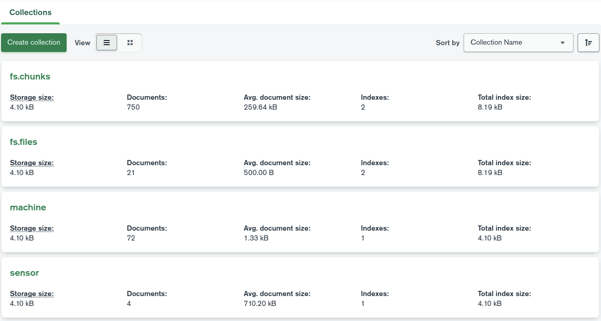

### 1. Store and get data simultaneously in real-time

#### This chapter explains how to store information from sensors on earthwork site such as location information and joint angles, terrain information. If you don't store sensor information, you can skip this chapter.

#
Run the following commands to store data in MongoDB and get the data.


#### Store sensor data
To store the position and joint angles of a construction vehicle to mongoDB, run the following steps:


Please rewrite "executable" and output topic neme, machine name to your system.

```
tms_sp_machine_odom_node1 = Node(
        name="tms_sp_machine_odom",
        package="tms_ur_construction",
        executable="<tms_sp_machine_odom or tms_sp_machine_posest, tms_sp_machine_joints>",
        output="screen",
        remappings=[
            ("~/input/odom", "<your output topic name>"),
        ],
        parameters=[
            {
                "machine_name": "<your machine name>",
            },
            {
                "to_frame": LaunchConfiguration("to_frame"),
            },
        ],
    )
```

| executable file name | message type of input | message type of stored data |
|--------|---------|---------|
|tms_sp_machine_odom | `nav_msgs::msg::Odometry` | `nav_msgs::msg::Odometry`|
|tms_sp_machine_posest | `geometry_msgs::msg::PoseStamped` | `geometry_msgs::msg::PoseStamped`|
|tms_sp_machine_joints | `sensor_msgs::msg::JointState` | `sensor_msgs::msg::JointState`|

Run the following commands to store data in MongoDB.

```
# MongoDB manager
ros2 launch tms_db_manager tms_db_manager.launch.py

# Odometry and JointStats
ros2 launch tms_sp_machine tms_sp_machine_odom_and_joints_launch.py
```
The position and orientation data of the construction machine is stored in "rostmsdb/machine_pose" on MongoDB, while joint core information is stored in "rostmsdb/machine_joints" on MongoDB.

<!--
#### Play rosbag
```
ros2 bag play -l ./src/ros2_tms_for_construction/demo/demo2/rosbag2_2
```


GUI tool of MongoDB like a MongoDB Compass is easy to check them.

Here is an example. It may be a little different than yours, but as long as it is roughly the same, you should be fine.


-->

### about terrain data

Since static terrain data does not need to be acquired in real time, it can be pre-generated in cyberspace.

**store static terrain data in MongoDB**

Point cloud data in .las format is converted and stored in MongoDB as a .png format heightmap and RGB image (terrain color image).

| data  | file type | output |
| -- | -- | -- |
| static terrain | .las(point cloud data) | .png(heightmap) & .png(terrain coloc image) & terrain scale|


```
# Static terrain
cd ros2-tms-for-construction_ws/src/ros2-tms-for-construction/tms_ss/tms_ss_terrain_static/tms_ss_terrain_static/las_to_heightmap

python save_image_to_mongodb.py <inputFile>.las --output <outputImage>.png
```

**road static terrain data from MongoDB**

Read the .png format heightmap and RGB image (terrain color image) stored in MongoDB and send them to "OperaSimVR" using ROS 2 service communication.
```
# Static terrain data
ros2 launch tms_ur_construction tms_ur_construction_terrain_mesh_launch.py filename_mesh:=<filename>
```
