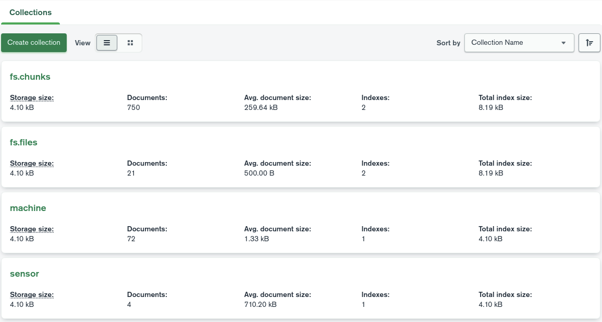

### 3. Store and get data simultaneously in real-time

Run the following commands to store data in MongoDB and get the data.

Static terrain data is not included because it does not need to be acquired in real-time.

#### Launch

```
# MongoDB manager
ros2 launch tms_db_manager tms_db_manager.launch.py

# Odometry and JointStats
ros2 launch tms_sp_machine tms_sp_machine_odom_demo_launch.py

# Static terrain
python save_image_to_mongodb.py <inputFile>.las --output <outputImage>.png

```


#### Launch tms_ur_construction

Run the following commands to get data from MongoDB.

```
# Get odometry and jointstates
ros2 launch tms_ur_construction tms_ur_cv_odom_demo_launch.py

# Static terrain data
ros2 launch tms_ur_construction tms_ur_construction_terrain_mesh_launch.py filename_mesh:=<filename>

```

#### Play rosbag

```
ros2 bag play -l ./src/ros2_tms_for_construction/demo/demo2/rosbag2_2
```

After the end of rosbag, please check whether the data is stored to fs.chunks, fs.files, machine and sensor collection in your MongoDB.

GUI tool of MongoDB like a MongoDB Compass is easy to check them.

Here is an example. It may be a little different than yours, but as long as it is roughly the same, you should be fine.


