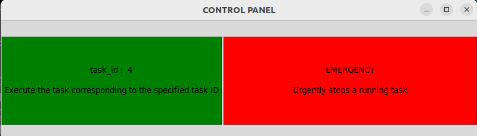
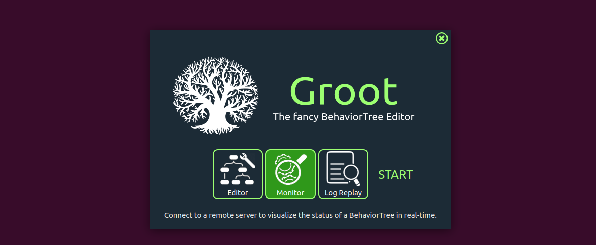
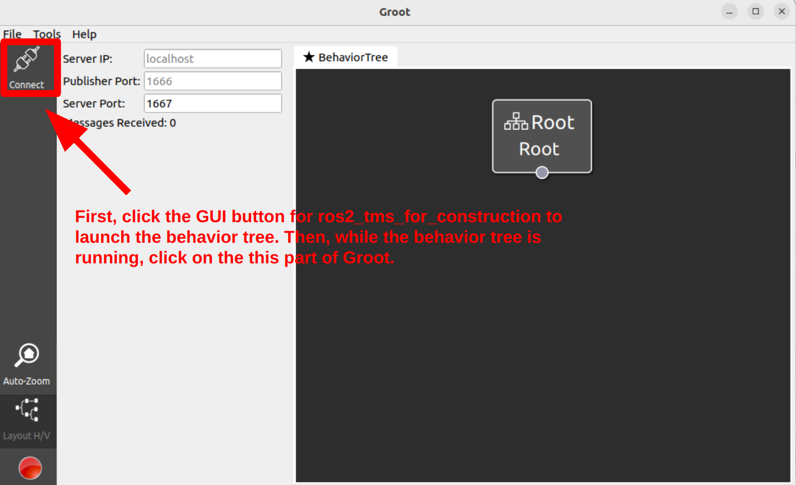
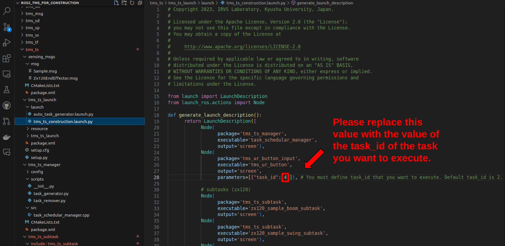

### 4. Try running the task schedular

本章ではタスクスケジューラの概要について説明するとともに、使用前の事前確認を行います。
従って、具体的なシミュレータ上の建設機械の操作方法はCHAPTER.5からとなっています。

ではまずはじめに、DBのセットアップを行います。MonoogoDB上にrostmsadbデータベースが存在し、その中にtaskコレクションとparameterコレクションが存在することを確認してください。この操作は以下の手順にしたがってMongoDbを使用して行うことができます。

1. まずはじめに端末を開き、以下のコマンドを実行してMongoDB Compassを起動します。
```
mongodb-compass --no-sandbox --disable-gpu
```
うまく起動できると以下の画像の画面が表示されます。

 

2. 上記画像のようにURIの欄が"mongodb://localhost:27017/" と入力されていることを確認したら"Connect" ボタンをクリックします. すると以下の画面が表示されます。


 3. 上記画像の画面において"rostmsdb"ボタンをクリックすると以下の画像が表示されます。この画面が表示されればデータベースのセットアップは完了しています。


もし、上記画像のようにrostmsdbデータデースやtaskコレクション、parameterコレクションが見つからない場合には以下のコマンドを実行してください。

```
cd ~/ros2-tms-for-construction_ws/src/ros2_tms_for_construction/demo
unzip rostmsdb_collections.zip
mongorestore dump
```

上記のコマンド実行後、先程の手順にしたがってデータベースを確認してください。データベースがうまく構築できていたら以下のコマンドを実効してください。

```
cd ~/ros2-tms-for-construction_ws
source install/setup.bash
ros2 launch tms_ts_launch tms_ts_construction.launch.py
```

すると以下の画像に示すGUIボタンが表示されます。



GUIボタンの緑色の部分をクリックすると、task_idに対応するタスクデータがMongoDBのrostmsdbデータベース内のtaskコレクションから読み出され、タスクスケジューラによって実行されます。また、GUIボタンの赤色の部分は緊急停止処理の実行ボタンです。タスクスケジューラによってタスクが実行されている状態でクリックすると全体の処理が停止します。

オプションとして、タスクスケジューラが実効しているタスクをモニタリングする機能があります。この機能は[Groot](https://www.behaviortree.dev/groot/)と呼ばれるツールに備わっており、この章でご紹介するモニタリング機能に加え、タスクを設計するエディタとしての機能も備わっています。モニタリング機能を利用する際は、前述のGUIボタンをクリックする前に以下の手順を実効してください。

```
cd ~/ros2-tms-for-construction_ws
./build/groot/Groot
```

上記のコマンドの実行後、以下の画面が表示されます。



上画像の"Edcitor"と記載されている部分をクリックすると先程説明したエディタ機能が、"Moniotor"と記載されている部分をクリックするとモニタ機能が利用できます。この章ではモニタ機能を利用するため、"Monitor"部分をクリックしてください。すると画像が遷移するので、パラメータ設定が以下のようになっていることを確認してください。


> The settings for use should be as follows.
> 
> ・ Server IP : localhost
> 
> ・ Publisher Port : 1666 
> 
> ・ Sever Port : 1667

パラメータの確認ができたら、先程表示したGUIボタンの緑色の部分をクリックしてください。そして、タスクスケジューラがタスクを実効している状態で、Grootの"Connect”と記載されている部分をクリックしてください。すると以下の画像のように、実行中のタスクの様子を確認することができます。


> **Note**
> 
> タスクスケジューラがタスクを実効していない状態でGrootのモニタリング機能を利用することはできません。その状態で以下の"Connect"ボタンをクリックすると、その下の画像のようにエラー表示がでます。
>
>  
>
>  
>  

最後に、タスクスケジューラが実行するタスクデータを変更する方法のご説明です。[タスク管理機構を起動するためのlaunchファイル](https://github.com/irvs/ros2_tms_for_construction/blob/main/tms_ts/tms_ts_launch/launch/tms_ts_construction.launch.py)を開き、画像の部分の数値を変更してください。この数値はMongoDBのrostmsdbデータベースのtaskコレクション内にある各々のタスクデータのtask_idの数値です。



変更後は以下のコマンドを実行してください

```
cd ~/ros2-tms-for-construction_ws
colcon build --packages-select tms_ts_launch && source install/setup.bash
```
以上でROS2-TMS for Constructionのセットアップと概要についての説明は完了です。
CHAPTER.5ではROS2-TMS for ConstructionとOperaSim-PhysXを接続して、実際にシミュレータ上の建設機械をROS2-TMS for Constructionから自律操作する方法についてご紹介します。

