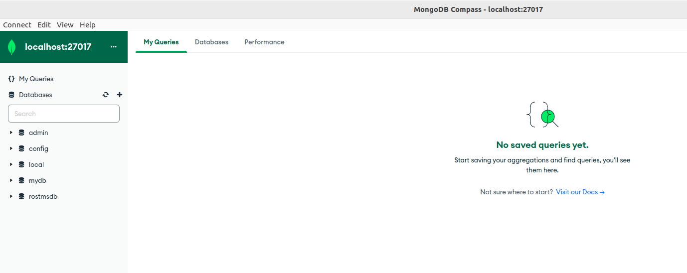
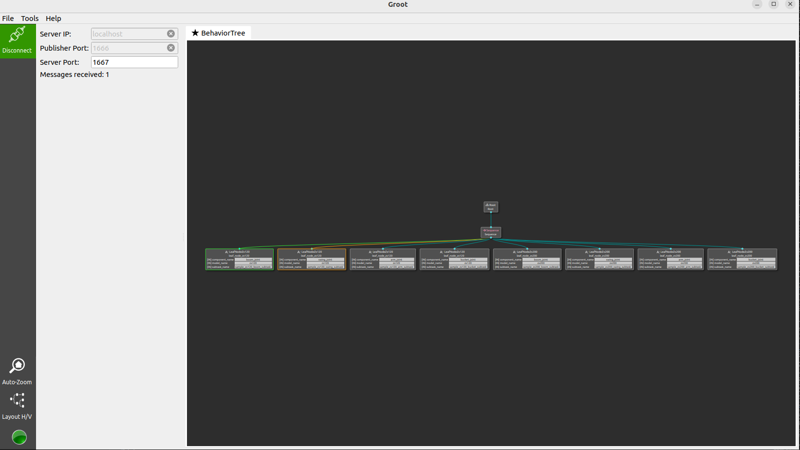

### 4. Try running the task schedular

In this chapter, we will explain how to use the task scheduler.
To successfully run the task scheduler, mongodb must be started by executing the following command.

```
sudo systemctl start mongod
``` 

 Before running the task scheduler, make sure that the task collection and the parameter collection are placed under rostmsdb database in MongoDB. Database verification can be done using mongodb compass. The confirmation procedure is as follows.
1. Start MongoDB Compass. The following screen will appear.
 

2. Confirm that the URI is entered as "mongodb://localhost:27017/" and press the "Connect" button. You will then see the following screen.


 3. Click on the "rostmsdb" button in the above screen, and if the screen looks like the following, the database setup is complete.


 If the database or collections does not exist, please execute the following command to add the database

```
sudo systemctl start mongod
cd ~/ros2-tms-for-construction_ws/src/ros2_tms_for_construction/demo
unzip rostmsdb_collections.zip
mongorestore dump
```


Once you have verified that MongoDB looks like the image above, execute the following command.

```
cd ~/ros2-tms-for-construction_ws
source install/setup.bash
ros2 launch tms_ts_launch tms_ts_construction.launch.py
```

The following GUI button will then be activated.


When this green button is pressed, the corresponding task is read from the mongodb and the Behavior Tree executes subtasks based on the corresponding task sequence.
The task to be executed at this time is the task data in the task collection of rostmsdb in mongodb. The number displayed to the right of the "task_id:" button is the task_id of the task data to be executed by task schedular. The summary of current task data stored in the DB is as presented in section 5.

**Also, the red button is for emergency stop. Press this button if you want to stop the Task Scheduler in an emergency when it is executing a task.**


Before you start executing tasks by pressing the GUI button described above, please execute the following command to launch Groot. Groot is a tool that functions both as an editor for creating sequences of tasks and as a monitor for observing the execution state of the task sequences being run by the Behavior Tree. In this section, we will introduce the monitoring functionality of Groot.

```
cd ~/ros2-tms-for-construction_ws
./build/groot/Groot
```
After executing the above command, if Groot can be successfully started, the following screen will be appeared.


In the above image, "Editor" is used to generate task sequence. On the other hand, "Monitor" is used to visualize the status of running tasks.

In this section, we will show you how to visualize the status of running tasks using the "monitor" function.

First, click on the "monitor" button of the previous screen to output the following screen.

After opening the screen, check that the parameter settings on this screen are as follows


> The settings for use should be as follows.
> 
> ・ Sensing IP : localhost
> 
> ・ Publisher Port : 1666 
> 
> ・ Sever Port : 1667

After setting each parameter, click the "connect" button to see how the task is running in the behavior tree, as shown in the image below.



> **Note**
> 
> The ability to visualize tasks being executed by Groot cannot be performed unless the task is being executed by the behavior tree. 
>　So, if you want to visualize the  task sequence on Groot, you have to follow  the step below.
>
>  
>
>  If you click the above button in Groot without the behavior tree running, the following error will occur.
>  
>  

If you want to change the task to be executed, update the following parameter in ros2_tms_for_construction/tms_ts/tms_ts_launch/launch/tms_ts_construction.launch.py to the task_id value of the task you want to execute, and then execute the following.

```
cd ~/ros2-tms-for-construction_ws
colcon build --packages-select tms_ts_launch && source install/setup.bash
```

