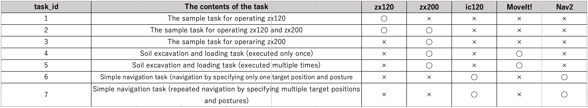

### 5. Try running the task schedular with OperaSim-PhysX

This chapter explain how to link ROS2-TMS for Construction and OperaSim-PhysX , which is being developed by PWRI as a simulator of OPERA.

Please follow the instructions described in the ReadMe on the official GitHub page of OperaSim-PhysX (URL: https://github.com/pwri-opera/OperaSim-PhysX) on how to set up windows PC and ubuntu 22.04 PC for using OperaSimPhysX.

Once the connection between OperaSim-PhysX and ROS2 Humble is established, run the following command to start ROS2-TMS-for-construction on Ubuntu22.04 PC.

```
cd ~/ros2-tms-for-construction_ws
source install/setup.bash
ros2 launch tms_ts_launch tms_ts_construction.launch.py
```

As explained in Chapter 4, you can execute the specified task using the task scheduler by clicking the green button that appears when starting ros2-tms-for-construction. If you want to make an emergency stop while executing a task, click on the red button.


Additionally, the current ROS2-TMS for Construction includes several tasks for operating actual construction machinery and machines on OperaSim-PhysX. 
The summary of the task data currently stored in the database is as follows:




Additionally, to successfully execute the tasks with task_id ranging from 3 to 7 as mentioned in the table above, it is necessary to pre-launch the ROS2 packages for zx200 and ic120 prepared on the OPERA. Because the packages to launch differ for cases involving the operation of zx200 and ic120, the procedures are explained separately below.

※ It is not necessary to execute the following command when running sample tasks (task_id: 1 ~ 3).

#### Packages for operating OPERA-compatible ZX200 on the OperaSim-PhysX using MoveIt! (task_id: 4, 5)
```
# Open the 1st terminal
cd ~/ros2-tms-for-construction_ws && source install/setup.bash
ros2 launch ros_tcp_endpoint endpoint.py

# Open the 2nd terminal
cd ~/ros2-tms-for-construction_ws && source install/setup.bash
ros2 launch zx200_unity zx200_standby.launch.py

# Open the 3rd terminal
cd ~/ros2-tms-for-construction_ws && source install/setup.bash
ros2 launch tms_if_for_opera tms_if_for_opera.launch.py

# Open the 4th terminal
cd ~/ros2-tms-for-construction_ws && source install/setup.bash
ros2 launch tms_ts_launch tms_ts_construction.launch.py task_id:=<task_id>
```
#### Packages for operating OPOERA-compatible IC120 on the OperaSim-PhysX using Nav2! (task_id: 6, 7) 
```
# Open the 1st terminal
cd ~/ros2-tms-for-construction_ws && source install/setup.bash
ros2 launch ros_tcp_endpoint endpoint.py

# Open the 2nd terminal
cd ~/ros2-tms-for-construction_ws && source install/setup.bash
ros2 launch ic120_unity ic120_standby_ekf.launch.py

# Open the 3rd terminal
cd ~/ros2-tms-for-construction_ws && source install/setup.bash
ros2 launch tms_ts_launch tms_ts_construction.launch.py task_id:=<task_id>
```


Of course, you can also use Groot to monitor the tasks being performed by the Behavior Tree while the Task Scheduler is running, as shown in the following video.


https://github.com/irvs/ros2_tms_for_construction/assets/130209264/8747df87-0dd9-42c4-9132-6454c15eeedf
