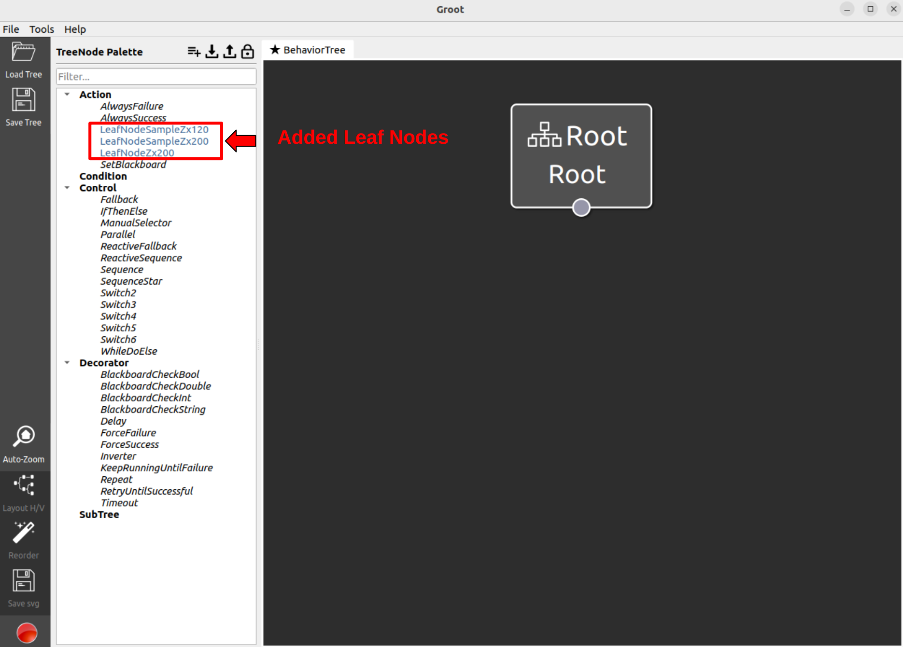

### 6. Insert new task data to tms_db

This section describes how to add new tasks to the database.

1. First, generate a new task sequence using Groot. When using Groot to generate a task sequence, it is necessary to register subtasks. Load the following file to make each subtask configurable.

Then the subtasks will appear in the node list section of Groot as shown in the following image.

Combining these nodes, we can create a task tree as shown below.


2. Please store the xml file of the task sequence generated using Groot under ros2_tms_for_construction/tms_ts/tms_ts_manager/config directory.The following is how to save the xml file of the task tree created in Groot.


3. Execute the following command to save the created task data to the database Replace [file_name] in the command with the filename of the xml file you created.
  ```
  cd ~/ros2-tms-for-construction_ws
  colcon build --packages-select tms_ts_manager && source install/setup.bash
  ros2 run tms_ts_manager task_generator.py --ros-args -p bt_tree_xml_file_name:=[file_name]
  ```
  For example, to store sample_construction_tree.xml in ros2_tms_for_construction/tms_ts/tms_ts_manager/config in the database as a task, run the following command.

  ```
  ros2 run tms_ts_manager task_generator.py --ros-args -p bt_tree_xml_file_name:=sample_construction_tree
  ```

4. You can see that the task just described has been added under the tasks collection in mongodb's rostmsdb database.