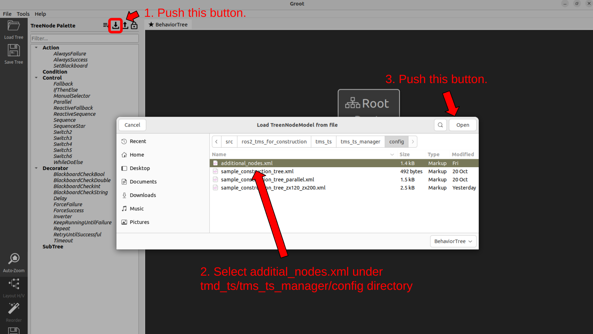

### 6. Insert new task data to tms_db

この章では、データベースにタスクデータを追加する方法についてご紹介します。


1. まずはじめに、Grootを使用して新たなタスク列を作成します。タスク列とは、タスクの実装であり、タスクスケジューラを使用して実行する一連の施工操作のシナリオデータです。タスク列はGrootのエディタ機能を使用して作成するのですが、ここには自作したノード類の情報は登録されていないので、手動でこれらを登録する必要があります。以下の手順にしたがって自作ノードを登録してください。



すると、Grootの画面上に我々が用意したノード類が表示され、使用できるようになります。


これらの標準のノードと自作ノードを組み合わせ、以下の画像のようにツリー上にタスクを構築します。


2. 次に先程作成したGroot上のタスクツリーを、xml形式で出力し、ros2_tms_for_construction/tms_ts/tms_ts_manager/configディレクトリに保管します。手順は以下の画像のとおりです。


3. その後、以下のコマンドを実行してください。以下のコマンド中の[file_name]の部分は、先程作成したxmlファイルのファイル名をしてください。このファイル名に拡張子は不必要です。(例：aaa.xml → aaa)

  ```
  cd ~/ros2-tms-for-construction_ws
  colcon build --packages-select tms_ts_manager && source install/setup.bash
  ros2 run tms_ts_manager task_generator.py --ros-args -p bt_tree_xml_file_name:=[file_name]
  ```
ros2 runを実行すると自動でメタデータが割り振られ、データベース格納時に自動で付与されたtask_idが出力されます。

4. 4章で説明したようにMongoDB Compassを使用して、rostmsdbデータベースのhtaskコレクション内を確認し、先程出力されたtask_idと同じIDを持つタスクデータが格納されていれば完了です。