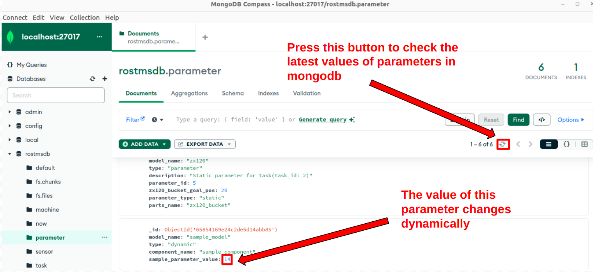

### 7. How to update parameters in mongodb based on topics from sensing pc

ROS2-TMS for Constructionでは、システム外部からセンシング処理を行った結果のデータを受け取るシステム構造をしています。本章ではセンシング処理結果を使用してデータベース上のパラメータデータを更新する方法についてご紹介します。

> **Note**
> 本章では、センシング処理を行うPCとROS2-TMS for Constructionを動作させるPCを分けることが可能です。各々のPCを分ける際には同じネットワクークに接続されていることとROS_DOMAIN_IDの設定値が同じであることを確認してください。ROS_DOMAIN_IDについては[公式資料](https://docs.ros.org/en/humble/Concepts/Intermediate/About-Domain-ID.html)をご確認ください。

1. まずはじめにセンシングPCからROS2 topicを介してROS2-TMS for Constructionにデータを送る際のデータ型を.msgファイルにて定義します。.msgファイルを実装後、ros2-tms-for-construction_ws/tms_ts/sensing_msgs/msgディレクトリ下に配置してください。.msgdファイルの実装例についてはros2-tms-for-construction_ws/tms_ts/sensing_msgs/msgディレクトリ下にいくつか実装したものが用意されているのでそちらを参考にしてください。本解説では、Sample.msgを例に説明していきます。

2. 1.の処理を完了したらROS2-TMS for Construction実行用PCでターミナルを開き、以下のコマンドを実行してください
  ```
  cd ~/ros2-tms-for-construction_ws
  colcon build --packages-select sensing_msgs tms_sp_sensing && source install/setup.bash
  ros2 run tms_sp_sensing sample
  ```

3. 次にセンシングPCでターミナルを開き、以下のコマンドを実行してください。
  ```
  cd 
  mkdir -p sensing_ws/src
  cd sensing_ws/src
  git clone -b master https://github.com/kasahara-san/sensing_sample_cps.git
  cd ..
  colcon build --packages-select sample_sensing_nodes sensing_msgs && source install/setup.bash
  ros2 run sample_sensing_nodes sample_publisher
  ```
5. そして。ROS2-TMS for Construction実行用PCでMongoDb Compassを起動し、rostmsdbデータベースのparameterコレクション下にあるmodel_nameが"sample_model"となっているパラメータデータに注目し、以下の画像の手順にしたがってMongoDB Compassの更新を行ってください。すると、データが更新されていっているのが確認できると思います。
※ MongoDB上の値は自動で更新されますが、MongoDB COmpass上のデータは以下の画像の手順にしたがって更新しないと、最新の値が表示されないのでご留意ください。


