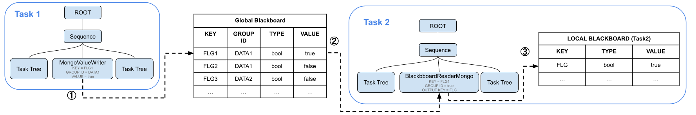
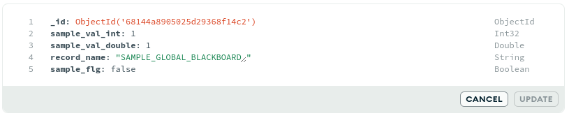
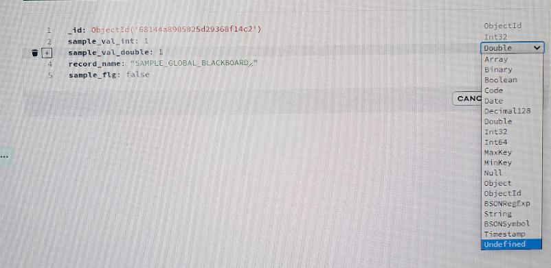
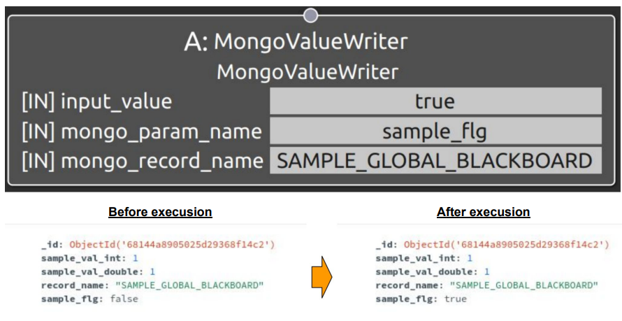
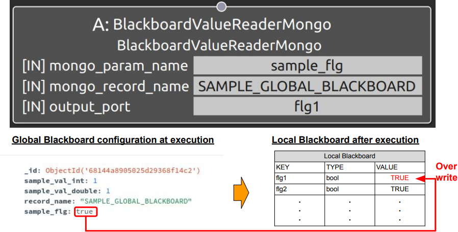
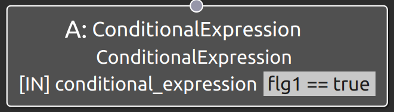

### 8. How to Use the Global Blackboard

Note: This feature is under development. In the provided sample program, you can run up to two specified tasks. Although it is technically possible to execute more tasks simultaneously, please be aware that you will need to modify parts of the program yourself to do so.

<!-- ※　本機能は開発途上であり、サンプルとして用意されているプログラムで実行可能なのは指定したタスク2つまでです。これ以上のタスクを同時に実行することも可能ですが、使用にはご自身でプログラムの一部を書き換えていただく必要がある点にご留意ください。 -->


#### Background of this implementation

Traditionally, Behavior Trees include a memory area called the [Local Blackboard](https://www.behaviortree.dev/docs/tutorial-basics/tutorial_02_basic_ports/) for sharing information among nodes within the task. However, there was no mechanism to exchange information between different Behavior Trees. In such cases, all operations had to be implemented as a single task within one Behavior Tree, which could easily lead to excessively large tasks. Furthermore, when multiple construction machines are involved in an operation, a failure in a single machine would force the entire operation (task) to stop, resulting in low flexibility. To address this, we have developed the Global Blackboard, which enables information sharing between different Behavior Trees. In the Global Blackboard approach, each task is implemented per autonomous vehicle, and by exchanging information via the Global Blackboard, we realize autonomous operations involving multiple construction machines.

<!-- 従来、Behavior TreeにはLocal Blackboardという同一のタスク内のノード間で情報を共有するためのメモリ領域が存在した。
一方で、異なるBehavior Tree間で情報をやり取りする仕組みは存在しなかった。
この場合、同一のタスク内ですべての施工を単一のタスクとして実装する必要があり、タスクのサイズが膨大になり易い。
また、複数台の建機を扱う施工の場合には建機1台の不具合で施工(タスク)全体を停止させなくてはならないなど、柔軟性も低いものとなる。
そこで、異なるBehavior Tree間での情報の共有を可能とするGlobal Blackboardを新たに開発した。
Globnal Blackboardでは個々のタスクを自律移動体ごとに実装するものとし、Global Blackboardを介して情報のやり取りを行うことで複数建機による自律化施工を実現する。 -->

#### Details of the Global Blackboard

The Global Blackboard is a mechanism for sharing information between different tasks via MongoDB, as shown below. Please note that this description provides an overview of the Global Blackboard and may differ from some internal implementation details.

<!-- Global Blackboardとは以下に示すように、MongoDBを介して異なるタスク間で情報共有を行う仕組みのことである。なお、本説明はGlobal Blackboardの概要を伝えるものであり、内部実装と一部異なる点には留意頂きたい。 -->



①　Task1 writes values to the Global Blackboard in MongoDB via a node called MongoValueWriter. MongoValueWriter has three ports: KEY, GROUP_ID, and VALUE. It searches for the corresponding data on the Global Blackboard using the two keys (KEY and GROUP_ID) and overwrites it with the value specified by VALUE.
②　Task2 reads values from the Global Blackboard in MongoDB via a node called BlackboardReaderMongo. BlackboardReaderMongo has three ports: KEY, GROUP_ID, and OUTPUT_KEY. It searches for the corresponding data on the Global Blackboard using the two keys (KEY and GROUP_ID). The value read from the Global Blackboard is then stored in the Local Blackboard parameter corresponding to OUTPUT_KEY.

The Local Blackboard is the built-in memory area in the Behavior Tree, and you can read values from it using the standard nodes. The usage of values on the Local Blackboard is described below.

<!-- ①　Task1はMongoValueWriterというノードを介してMongoDB上のGlobal Blackboardへ値の書き込みを行う。この際、MongoValueWriterはKEY, GROUP_ID, VALUEの3つのポートを持ち、KEY, GROUP IDの2種類のキーを元にGlobal Blackboard上の該当するデータを検索し、VALUEで指定された値で上書きする。
②　Task2はBlackboardReaderMongoというノードを介してMongoDB上のGlobal Blackboardから値の読み出しを行う。BlackboardReaderMongoはKEY, GROUP ID, OUTPUT KEYの3つのポートを持ち、KEY, GROUP IDの2種類のキーを元にGlobal Blackboard上の該当するデータを検索する。Global Blackboardから読み出してきた値は、OUTPUT KEYで指定された値と対応するLocal Blackboard上のパラメータに格納する。

なお、Local BlackboardはBehavior Treeに標準搭載されているメモリ領域であり、標準で用意されているノードを指定して読み出してくることが可能である。Loacal Blackboard上の値の使用方法については以下に記載する。 -->

#### Usage

Note: In the following description, we refer to the data group placed under rostmsdb/parameter as "parameter data," and the elements within parameter data, excluding _id and record_name, as "parameters."

<!-- ※　以下の説明ではrostmsdb/parameter直下に配置に配置してあるパラメータのまとまりとなるデータを"パラメータデータ"と、パラメータデータ内の_id, record_nameを除く要素を"パラメータ"と呼ぶ。 -->

① Prepare the parameters for the Global Blackboard in MongoDB.Place your parameter data directly under rostmsdb/parameter, ensuring it always includes _id and record_name as shown below. The _id is the MongoDB identifier automatically assigned when the data is created. The record_name is the key ROS2‑TMS for Construction uses to find parameter data; make sure it does not conflict with other parameter datas under rostmsdb/parameter. Add any other parameters you need following the example.

<!-- ①　まずはじめにMongoDB上にGlobal Blackboardとして使用するパラメータを用意する必要がある。パラメータデータはrostmsdb/parameter直下に配置し、以下に示すように_id, record_nameを必ず含むようにする。_idはMongoDBにおけるデータ識別用のIDでパラメーラデータ作成時に自動で付与される値である。また、record_nameはROS2-TMS for Constructionがパラメータデータを検索する際のキーとなる値でありrostmsdb/parameter直下に置かれている他のパラメータデータと被らないようにする。また、必要に応じてGlobal Blackboard上に置きたいパラメータを以下の例にしたがって配置する。 -->



For parameters, the following types are provided, and users can freely configure them as needed:

<!-- なお、パラメータの方に関しては、以下のものが用意されており、この中から利用者が自由に設定することができる。 -->



②　Construct your task.Refer to [CHAPTER 6](./CHAPTER6.md) for the overall procedure. Below are the three node types provided for operating the Global Blackboard:

<!-- ②　次にタスクを構築する。大まかな手順についてはCHAPTER6を参照願いたい。ここではGlobal Blackboardの操作のために用意したノード群として、MonogValueWriter, BlackboardValueReaderMongo, ConditionalExpressionという3種類のノードについて紹介する。 -->


・　MongoValueWriter

Overwrites a value on the Global Blackboard. Ports: input_value, mongo_param_name,mongo_record_name. Using mongo_param_name and mongo_record_name, it finds the matching entry on the Global Blackboard and overwrites it with input_value. For example, with the ports set as shown, executing this node changes the sample_flg value in the sample data to true.

<!-- 前述の通り、タスクからBlackboard上の値を書き換えるためのノードである。input_value, mongo_param_name, mongo_record_nameという3種類のノードを持ち、mongo_param_name, mongo_record_nameの2種類のキーを元にGlobal Blackboard上の該当するデータを検索し、input_valueで指定された値で上書きする。例えば以下のようにポートの値を指定した場合には、Behavior Treeがタスクの実装に則り当該ノードを実行した時点で上記画像のサンプルパラメータデータ上のsample_flgの値がtrueに書き換えられる。 -->



・　BlackboardValuereaderMongo

Reads a value from the Global Blackboard. Ports: output_port, mongo_param_name, mongo_record_name. Using mongo_param_name and mongo_record_name, it finds the matching entry, then stores the read value in the Local Blackboard parameter named by output_port. For example, with the ports set as shown, executing this node reads sample_flg and updates the corresponding Local Blackboard parameter.

<!-- 前述の通り、タスクがGlobal Blackboard上の値を読み出してくる際に用いるノードである。BlackboardReaderMongoはoutput_port, mongo_param_name, mongo_record_nameの3つのポートを持ち、mongo_param_name, mongo_record_nameの2種類のキーを元にGlobal Blackboard上の該当するデータを検索する。Global Blackboardから読み出してきた値は、output_portで指定された値と対応するLocal Blackboard上のパラメータに格納する。例えば以下のようにポートを指定した場合にはBehavior Treeがタスクの実装に則り当該ノードを実行した時点で上記画像のサンプルパラメータデータ上のsample_flgの値を読み出して、Local Blackboard上からoutput_portに対応するパラメータを検索し、当該の値を読み出してきた値で更新する。 -->



・　ConditionalExpression

Evaluates a condition using [Exprtk](https://github.com/ArashPartow/exprtk), supporting various data types (unlike the standard Blackboard condition node). You can reference Local Blackboard values in the expression. The node returns true or false to its parent IF node, which switches child execution based on the result. For example, with the ports set as shown, it checks the Local Blackboard key fgl1; if that value exists and is true, it returns true.

<!-- 条件判定を行うノードである。従来のBlackboardにも条件判定のノードが存在したものの、同一の型をもつ値しか条件式に使用できなかったりと汎用性に乏しかった。このため、Exprtkをベースに、様々なデータ型を条件判定式で使用可能なノードを新たに構築した。本ノードでは以下に示すようにLocal Blackboard上の値を条件式に指定することが可能となっている。条件判定の結果に応じて親ノードにTrue/Falseに対応する値を返却する。基本的に本ノードの親ノードにはIFノードが存在し、条件判定結果に応じて実行する子ノードを切り替えることでタスクの挙動を変化させる。例えば以下のように指定した場合、Local Blackboard上のfgl1というキーを持つデータを検索し、該当するデータが存在した場合には値を読み出してきて、これがtrueであれば親ノードへtrueに対応する値を返却する。 -->



By combining these nodes, you can share information across Behavior Trees while executing a sequence of operations. Note that Global Blackboard values are not reset automatically—use MongoValueWriter at the start of your task tree to clear or initialize values as needed. After implementation, store your task data in MongoDB following [CHAPTER 6](./CHAPTER6.md).

<!-- 上記のノードを組み合わせてタスクを構築することでBehavior Tree間で情報共有しつつ一連の施工を行うことが可能となる。
なお、タスクの設計に際しては、自動でGlobal Blackboard上の値がリセットされない点にご留意いただきたい。したがって、タスクツリーの先頭でMongoValueWriterを使用してGlobal Blackboard上の値をリセット可能な形にしておくことをおすすめする。

タスクの実装が完了したらCHAPTER6の手順にしたがってMonogDB上にタスクデータを格納してください。 -->

③ Run multiple tasks simultaneously.Execute the following command to confirm that two tasks run at the same time:

<!-- ③最後に、以下のコマンドを実行すると2つのタスクが同時に実行されることが確認可能できる。 -->

```
ros2 launch tms_ts_launch sample_for_globalblackboard.launch.py task_id1:=[the task_id of the 1st task data you want to execute], task_id2:=[the task_id of the 2nd task data you want to execute]
```


