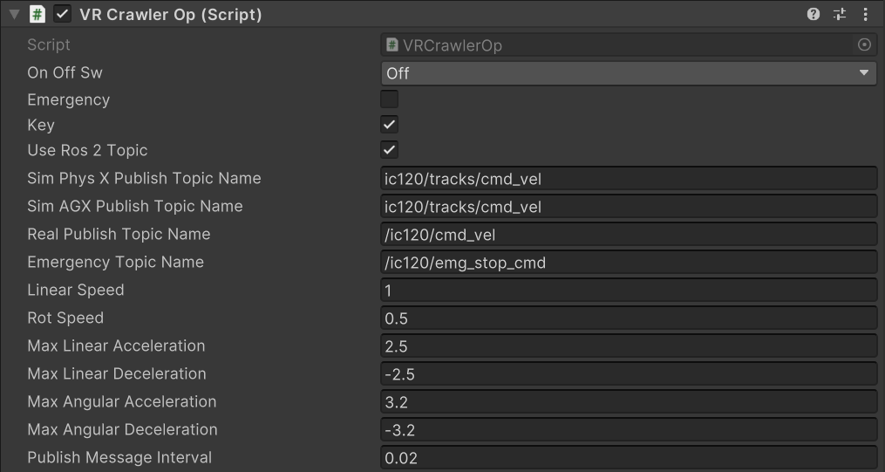

## §2. Control mode (controll finction)
In this system, real construction machinery can be remotely operated. By using a VR controller or keyboard, control commands are sent to the machinery via ROS2 topics. Just like in Play mode, position and orientation data are received from the real machinery through ROS2 topics. This data is used to animate the model of the machinery in the virtual environment, allowing the operator to monitor its movements in real time while performing remote operation.

### §2.1 When using in normal mode(Crawler dump)
0. Specify the topic name, speed, acceleration/deceleration, and the topic publishing interval before play. Start playback after completing the settings.
1. Switch to normal mode. 
2. Get into the model of the construction machine you want to operate. 
3. Turn on the controller. When using a VR headset, press the X button (Button.Three) on the VR controller. If not using VR, press the X key on the keyboard. Alternatively, you can set "OnOffSw" to "On" in the "VRCrawlerOp" script attached to each construction machine from the Inspector. 
4. Uncheck "UseRos2Topic" in the "VRCrawlerOp" script (unchecking this will prevent the machine from receiving topics from external sources). If operating with the keyboard, check the "Key" checkbox. 

From this point on, the construction machine you are in will respond to inputs from either the VR controller or the keyboard.

5. To end the operation, press the B button to dismount. (The controller (VRCrawlerOp) will be turned off.)

6. If you want to control it using an external topic, uncheck "UseRos2Topic" in "VRCrawlerOp".

### §2.2 When using in play mode(Crawler dump)
0. Specify the topic name, speed, acceleration/deceleration, and the topic publishing interval before play. Start playback after completing the settings.
1. Switch to normal mode. 
2. Get into the model of the construction machine you want to operate. 
3. Turn on the controller. When using a VR headset, press the X button (Button.Three) on the VR controller. If not using VR, press the X key on the keyboard. Alternatively, you can set "OnOffSw" to "On" in the "VRCrawlerOp" script attached to each construction machine from the Inspector. 

Note: From this point on, operating the VR controller or the keyboard will send command topics. Double-check in the Inspector that the values for movement commands such as forward motion and turning, as well as acceleration, are set appropriately.

4. To perform an emergency stop during operation, press the Y button on the left VR controller when using VR, or press the C key when using a keyboard. If a collision with the "geofence" occurs, the "emergency_sw" will also be set to true, triggering an emergency stop.
5. To end the operation, press the B button to dismount. (The controller (VRCrawlerOp) will be turned off.)

**explanation of parameter**
| parameter name | description |
|--------|---------|
|Terrain | Terrain that deforms into the actual landscape.
|Heightmap | Specify the uploaded heightmap image.
|Texture | Specify the uploaded texture image.
|TerrainWidth| Length of the horizontal edge of the terrain to load (m)
| TerrainHeight | Length of the depth edge of the terrain to load (m)
| TerraineElevation | Length of the vertical edge (height) of the terrain to load (m)
|WidthTexture| Length of the horizontal edge of the texture (e.g., RGB aerial image) to load (m)
|HeightTexture| Length of the depth edge of the texture (e.g., RGB aerial image) to load (m)
|OffsetWidthTexture| Offset to adjust the alignment between the texture (e.g., RGB aerial image) and the terrain in the horizontal direction (m)
|OffsetHeightTexture| Offset to adjust the alignment between the texture (e.g., RGB aerial image) and the terrain in the depth direction (m)
|TerrainRecordSw| Check this option if you want the deformed terrain to remain unchanged even after stopping Unity's Play mode.

### §2.3 Operation Method
**When you use VR goggles**
| operation | controller operation |
|--------|---------|
|Roaming in cyberspace | Use the D-pad (Axis2D.PrimaryThumbstick) on the left controller to move. Pushing it forward moves you forward, backward moves you back, left strafes left, and right strafes right.
|Change Direction | Use the D-pad (Axis2D.SecondaryThumbstick) on the right controller to change direction. Pushing it to the left rotates to the left, and pushing it to the right rotates to the right.
|Overview (Bird’s-Eye View) | Pressing both the X button (Button.Three) and the Y button (Button.Four) on the left controller simultaneously switches to a bird’s-eye view. Pressing the X button makes you ascend, and pressing the Y button makes you descend. The methods for moving forward, backward, sideways, and changing direction are the same as when "Roaming in cyberspace" or "Change Direction". To return to walking on the ground, press the B button (Button.Two) on the right controller.
|Board the construction equipment model. | Point the Lay from the left controller at the construction equipment model you want to board, and then press the trigger (Axis1D.PrimaryIndexTrigger) on the left controller.To disembark, press the B button (Button.Two) on the right controller.

----

**When you  operate from the keyboard**
| operation | controller operation |
|--------|---------|
|Roaming in cyberspace | Use the arrow keys on the keyboard to move. Press the up arrow to move forward, the down arrow to move backward, Shift + left arrow to move left, and Shift + right arrow to move right.
|Change Direction | Use the arrow keys on the keyboard to rotate. Press the left arrow to rotate left, and the right arrow to rotate right.
|Overview (Bird’s-Eye View) | Use the arrow keys on the keyboard. Press the left Shift key + up arrow to ascend, and the left Shift key + down arrow to descend.
|Board the construction equipment model. | Face the construction equipment you want to board and press the V key. To disembark, press the B key.

