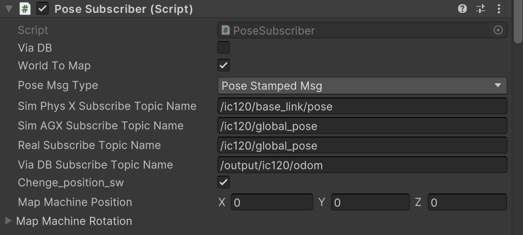
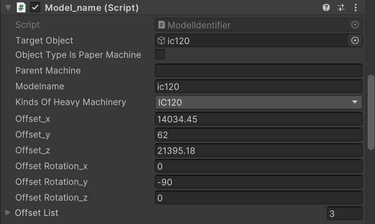
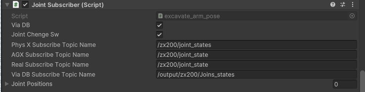

## Usege of this system
In this system, two PCs are used: one for launching OperaSimVR (PC_A), and another (PC_B) that communicates with construction machinery via ROS 2. PC_B is connected to the actual machinery and runs ros_tcp_endpoint to establish communication with PC_A. When immersing in the cyber space using a VR headset (Quest), PC_A and the Quest headset are connected via Air Link or Quest Link.

## Install
#### OPERASimVR(PC_A)
Clone from ~~~~~~~~~ on PC_A.

#### Unity(PC_A)
If a Unity environment is not available, set up the Unity environment on PC_A. The operating system should preferably be either Windows or macOS. Install Unity Hub from https://unity.com/ja/download, and install Unity Editor version 2022.3.4f1 from https://unity.com/ja/releases/editor/archive.

#### System Environment Setup for Meta Quest VR Headset(PC_A)
If you use VR headset (Quest), please refer to official page of Meta (https://www.meta.com/ja-jp/help/quest/1517439565442928/) for instructions on how to use Meta Quest Link and Air Link. For the PC requirements when using Meta Quest, please refer to Meta’s official website(https://www.meta.com/ja-jp/help/quest/140991407990979/).

#### ROS2_TMS_FOR_CONSTRUCTION(PC_B)
Please clone ROS2_TMS_FOR_CONSTRUCTION from https://github.com/irvs/ros2_tms_for_construction  on PC_B. When setting up the ROS2_TMS_FOR_CONSTRUCTION environment, ROS-TCP-ENDPOINT will also be cloned and become available for use.

## setup
1. Launch Unity Hub and add the cloned OperaSimVR by selecting "Add" from the top right of the screen.
2. Once OperaSimVR is opened, navigate to "Asset/Scenes/SampleScene."unity and open it.
3. From the top toolbar in the Unity Editor, go to "Robotics" > "ROS Setting". Change the "Protocol" to "ROS2", and set the "ROS IP Address" to the IP address of PC_B.

# OperasimVR
OperasimVR has 4 functions(nomal mode and play mode, controll mode, preview mode). Nomal mode is 

## Playmode (visualizeation finction)
The system receives the position, orientation, and joint angle data published by the real heavy machinery as ROS 2 topics, and updates the corresponding position, orientation, and joint angles of the machinery model within the system. As a result, the heavy machinery model in OperaSimVR moves in sync with the real-world machine.

**crawler dump**
| Type of information | Message type                       | Description                                                 |
| ------------------------------------- | ----------------------------------- | ----------------------------------------------------------- |
| position and orientation | `sensor_msgs::msg::JointState` `nav_msgs::msg::Odometry`      | Position and orientation of each machine. Plane Cartesian Coordinate System Reference. |
| angle of joints | `sensor_msgs::msg::JointState` | vessel angle of each machine |

**backhoe**
| Type of information | Message type                       | Description                                                 |
| ------------------------------------- | ----------------------------------- | ----------------------------------------------------------- |
| position and orientation | `sensor_msgs::msg::JointState` `nav_msgs::msg::Odometry`      | position and orientation of each machine. Plane Cartesian Coordinate System Reference .|
| angle of vessel | `sensor_msgs::msg::JointState` | angle of swing and boom, arm, bucket of each machine |

### about settings of location information subscriber 
Set from the "PoseSubscriber" attached to the construction machine.

**explanation of parameter**
| parameter name | description |
|--------|---------|
|ViaDB | Check this box if you want to retrieve information via a database. 
|WorldToMap | Check this box to convert the acquired coordinate values ​​from the world coordinate system to the map coordinate system.
|PoseMsgType | Select the topic type of the topic you want to subscribe to.
|SimPhysXSubscribeTopicName | Specify the topic name of PhysX location information (for operation test).
|SimAGXSubscribeTopicName | Specify the topic name of AGX location information (for operation test).
|RealSubscribeTopicName | Specify the topic name that publishes the position and joint information of the actual machine.
|ViaDBSubscribeTopicName | Specifies the topic name when going through a database.
|ChengePosition_sw | Check if you want to change the position of the construction machine model.
|MapMachinePosition | Don't change.
|MapMachineRotation | Don't change.

### How to convert from world coordinate system to map coordinate system

The origin of the map coordinates in the world coordinate system is specified by the "Model_name" attached to each construction equipment object. Move the object's MapReferencePoint to the same position in the cyberspace field as the origin of the map coordinate system of the actual field.

**explanation of parameter**
| parameter name | description |
|--------|---------|
|Offset_x,Offset_y,Offset_z | Coordinates in the world coordinate system of the origin of the map coordinate system. y coordinate in x-plane Cartesian coordinates, z coordinate in y-plane Cartesian coordinates, x coordinate in z-plane Cartesian coordinates |
|OffsetRotation_x,y,z| If the model orientation is different from the direction of travel, change the orientation. |

### about settings of joints information subscriber 
Set from the "JointSubscriber" attached to the construction machine.

**explanation of parameter**
| parameter name | description |
|--------|---------|
|ViaDB | Check this box if you want to retrieve information via a database. 
|JointChangeSw | Check if you want to change the joint angles of the construction machine model.
|SimPhysXSubscribeTopicName | Specify the topic name of PhysX location information (for operation test).
|SimAGXSubscribeTopicName | Specify the topic name of AGX location information (for operation test).
|RealSubscribeTopicName | Specify the topic name that publishes the position and joint information of the actual machine.
|ViaDBSubscribeTopicName | Specifies the topic name when going through a database.
|JointPositions | Don't change.

