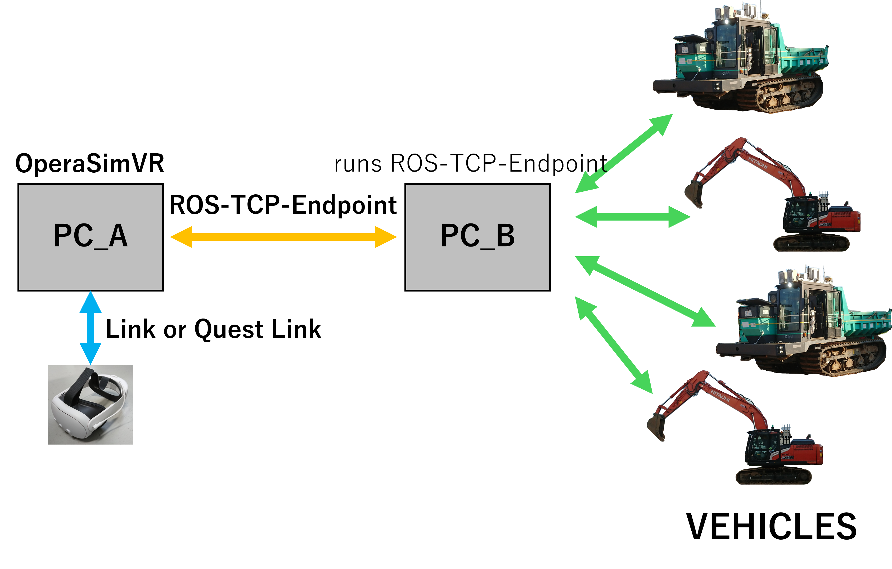
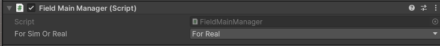
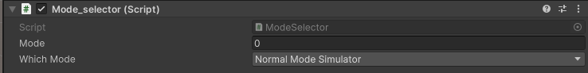
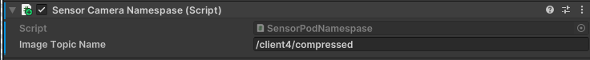
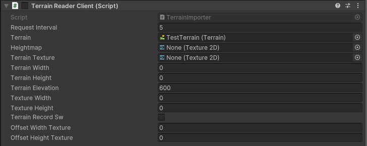
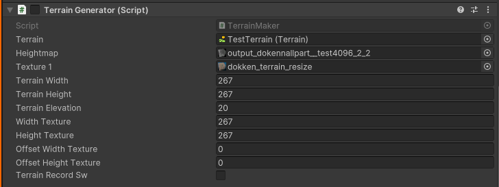

## Usege of this system
In this system, two PCs are used: one for launching OperaSimVR (PC_A), and another (PC_B) that communicates with construction machinery via ROS 2. PC_B is connected to the actual machinery and runs ros_tcp_endpoint to establish communication with PC_A. The system can be used either with a VR headset or without one, using keyboard controls. When immersing in the cyber space using a VR headset (Quest), PC_A and the Quest headset are connected via Air Link or Quest Link.

## Install
#### OPERASimVR(PC_A)
Clone from ~~~~~~~~~ on PC_A.

#### Unity(PC_A)
If a Unity environment is not available, set up the Unity environment on PC_A. The operating system should preferably be either Windows or macOS. Install Unity Hub from https://unity.com/ja/download, and install Unity Editor version 2022.3.4f1 from https://unity.com/ja/releases/editor/archive.

#### System Environment Setup for Meta Quest VR Headset(PC_A)
If you use VR headset (Quest), please refer to official page of Meta (https://www.meta.com/ja-jp/help/quest/1517439565442928/) for instructions on how to use Meta Quest Link and Air Link. For the PC requirements when using Meta Quest, please refer to Meta’s official website(https://www.meta.com/ja-jp/help/quest/140991407990979/).

#### ROS2_TMS_FOR_CONSTRUCTION(PC_B)
Please clone ROS2_TMS_FOR_CONSTRUCTION from https://github.com/irvs/ros2_tms_for_construction  on PC_B. When setting up the ROS2_TMS_FOR_CONSTRUCTION environment, ROS-TCP-ENDPOINT will also be cloned and become available for use.

## setup
1. Launch Unity Hub and add the cloned OperaSimVR by selecting "Add" from the top right of the screen.
2. Once OperaSimVR is opened, navigate to "Asset/Scenes/SampleScene."unity and open it.
3. From the top toolbar in the Unity Editor, go to "Robotics" > "ROS Setting". Change the "Protocol" to "ROS2", and set the "ROS IP Address" to the IP address of PC_B.

# OperasimVR
OperaSimVR was developed as an extension of OperaSim. OperasimVR has 4 functions(nomal mode and play mode, controll mode, preview mode). This system includes not only the original simulator function (Standard Mode) from OperaSim, but also a visualization function (Playback Mode), a control function (Control Mode), and a preview function (Preview Mode).

## §0. Usage Instructions
This system can be used either with immersive VR goggles or without them by operating from the keyboard. In both cases, there are situations where interaction with Unity's Inspector window is required.

### Move through the cyber (virtual) space.

**When you use VR goggles**
| operation | controller operation |
|--------|---------|
|Roaming in cyberspace | Use the D-pad (Axis2D.PrimaryThumbstick) on the left controller to move. Pushing it forward moves you forward, backward moves you back, left strafes left, and right strafes right.
|Change Direction | Use the D-pad (Axis2D.SecondaryThumbstick) on the right controller to change direction. Pushing it to the left rotates to the left, and pushing it to the right rotates to the right.
|Overview (Bird’s-Eye View) | Pressing both the X button (Button.Three) and the Y button (Button.Four) on the left controller simultaneously switches to a bird’s-eye view. Pressing the X button makes you ascend, and pressing the Y button makes you descend. The methods for moving forward, backward, sideways, and changing direction are the same as when "Roaming in cyberspace" or "Change Direction". To return to walking on the ground, press the B button (Button.Two) on the right controller.
|Board the construction equipment model. | Point the Lay from the left controller at the construction equipment model you want to board, and then press the trigger (Axis1D.PrimaryIndexTrigger) on the left controller.To disembark, press the B button (Button.Two) on the right controller.

----

**When you  operate from the keyboard**
| operation | controller operation |
|--------|---------|
|Roaming in cyberspace | Use the arrow keys on the keyboard to move. Press the up arrow to move forward, the down arrow to move backward, Shift + left arrow to move left, and Shift + right arrow to move right.
|Change Direction | Use the arrow keys on the keyboard to rotate. Press the left arrow to rotate left, and the right arrow to rotate right.
|Overview (Bird’s-Eye View) | Use the arrow keys on the keyboard. Press the left Shift key + up arrow to ascend, and the left Shift key + down arrow to descend.
|Board the construction equipment model. | Face the construction equipment you want to board and press the V key. To disembark, press the B key.

## §1.  Play mode (visualizeation function)
The system receives the position, orientation, and joint angle data published by the real heavy machinery as ROS 2 topics, and updates the corresponding position, orientation, and joint angles of the machinery model within the system. As a result, the heavy machinery model in OperaSimVR moves in sync with the real-world machine.

### §1.1 about handling information

**crawler dump**
| Type of information | Message type                       | Description                                                 |
| ------------------------------------- | ----------------------------------- | ----------------------------------------------------------- |
| position and orientation | `sensor_msgs::msg::JointState` `nav_msgs::msg::Odometry`      | Position and orientation of each machine. Plane Cartesian Coordinate System Reference. |
| angle of joints | `sensor_msgs::msg::JointState` | vessel angle of each machine |

**backhoe**
| Type of information | Message type                       | Description                                                 |
| ------------------------------------- | ----------------------------------- | ----------------------------------------------------------- |
| position and orientation | `sensor_msgs::msg::JointState` `nav_msgs::msg::Odometry`      | position and orientation of each machine. Plane Cartesian Coordinate System Reference .|
| angle of vessel | `sensor_msgs::msg::JointState` | angle of swing and boom, arm, bucket of each machine |

The following describes the configuration required for each piece of construction equipment to subscribe to position, orientation, and joint information.
***
***

### §1.1.1 about settings of location information subscriber 

#### (a) Setting the topic names and message types in ROS 2.
Set from the "PoseSubscriber" attached to the construction machine.

**explanation of parameter**
| parameter name | description |
|--------|---------|
|ViaDB | Check this box if you want to retrieve information via a database. 
|WorldToMap | Check this box to convert the acquired coordinate values ​​from the world coordinate system to the map coordinate system.
|PoseMsgType | Select the topic type of the topic you want to subscribe to.
|SimPhysXSubscribeTopicName | Specify the topic name of PhysX location information (for operation test).
|SimAGXSubscribeTopicName | Specify the topic name of AGX location information (for operation test).
|RealSubscribeTopicName | Specify the topic name that publishes the position and joint information of the actual machine.
|ViaDBSubscribeTopicName | Specifies the topic name when going through a database.
|ChengePosition_sw | Check if you want to change the position of the construction machine model(You can switch it on and off even while playing).
|MapMachinePosition | Don't change.
|MapMachineRotation | Don't change.

#### (b) convert from world coordinate system to map coordinate system

The origin of the map coordinates in the world coordinate system is specified by the "Model_name" attached to each construction equipment object. And move the object's "MapReferencePoint" to the same position in the cyberspace field as the origin of the map coordinate system of the actual field.

**explanation of parameter**
| parameter name | description |
|--------|---------|
|Offset_x,Offset_y,Offset_z | Coordinates in the world coordinate system of the origin of the map coordinate system. y coordinate in x-plane Cartesian coordinates, z coordinate in y-plane Cartesian coordinates, x coordinate in z-plane Cartesian coordinates(You can switch it on and off even while playing). |
|OffsetRotation_x,y,z| If the model orientation is different from the direction of travel, change the orientation(You can switch it on and off even while playing). |

***
### §1.1.2 about settings of joints information subscriber 
Set from the "JointSubscriber" attached to the construction machine.

**explanation of parameter**
| parameter name | description |
|--------|---------|
|ViaDB | Check this box if you want to retrieve information via a database. 
|JointChangeSw | Check if you want to change the joint angles of the construction machine model(You can switch it on and off even while playing).
|SimPhysXSubscribeTopicName | Specify the topic name of PhysX location information (for operation test).
|SimAGXSubscribeTopicName | Specify the topic name of AGX location information (for operation test).
|RealSubscribeTopicName | Specify the topic name that publishes the position and joint information of the actual machine.
|ViaDBSubscribeTopicName | Specifies the topic name when going through a database.
|JointPositions | Don't change.

***  
*** 

The above describes the configuration required for each piece of construction equipment to subscribe to position, orientation, and joint information.

 
### §1.2 The configuration required in the environment to use Play Mode
The following explains the configuration required in the environment to use Play Mode.

### §1.2.1 configuration of the connection target (simulator or actual machine)
When using it with the real heavy machinery, set the parameter "ForSimOrReal" of the script "FieldMainManager" attached to "FieldManager" to "ForReal". For operation testing with PhysX or AGX, set SimOrReal to ForSimPhysX or ForSimAGX instead. By changing this, the topic name, topic type, and the type of information transmitted and received will be altered. Avoid changing it during play.

### §1.2.2 configuration of using mode
If you want to change the mode, modify the parameter "WhichMode" of script "ModeSelector" attached to "FieldManager": set it to "NomalModeSimulator" for "NomalMode", "PlayMode" for "PlayMode", and "PrevievMode" for "PrevievMode". When you use PlayMode, set "WhichMode" to "PlayMode".

### §1.2.3 Setting the origin of the map coordinate system in the cyber space.
Move the object's "MapReferencePoint" to the same position in the cyberspace field as the origin of the map coordinate system of the actual field.

### §1.3 SensorPod Images
This system can display images from cameras by linking with sensor pods (sensor cameras) installed in the field.

**sensor pod(sensor camera)**
| Type of information | Message type                       | Description                                                 |
| ------------------------------------- | ----------------------------------- | ----------------------------------------------------------- |
| movie | `sensor_msgs::CompressedImage`  | Movie from sensor pods(sensor cameras). |

#### Setting the topic names in ROS 2.
For each child object ("SensorPod") under "SensorPods", specify the topic name for subscribing to sensor pod (sensor camera) images in the parameter "ImageTopicName" of the attached script "SensorCameraNamespace".

## about terrain 
This system allows for terrain reconstruction using real-world field terrain data. There are three methods for creating terrain:

1. Reading point cloud data in LAS format.

2. Importing terrain data and textures converted to a heightmap, then generating the terrain using a script.

3. Importing terrain data and textures converted to a heightmap, then shaping the terrain via "Terrain Toolbox" and the Inspector.

About Method 1: Reading Point Cloud Data in LAS Format
In this method, terrain is created by importing point cloud data stored in the LAS format, which is commonly used for representing 3D spatial information obtained from sources like LiDAR. The workflow generally involves the following steps:
1. Convert the LAS data and store it in the TMS_DB. For details, refer to ～～.
2. Start the ROS 2 service for reading terrain data stored in the TMS_DB (for details, refer to ～～～). 
3. When the TerrainImporter attached to the terrain object is activated, it sends a request to the server that provides the terrain data. The stored terrain data is then retrieved and transmitted back.

**explanation of parameter**
| parameter name | description |
|--------|---------|
|RequestInterval | The interval (in seconds) at which requests are sent to the server to retrieve terrain data.
|Terrain | Terrain that deforms into the actual landscape.
|TerrainRecordSw | Check this option if you want the deformed terrain to remain unchanged even after stopping Unity's Play mode.

You do not need to modify the other parameters, as they will be updated automatically upon receiving the retrieved terrain data.

About Method 2: Upload heightmap and texture to Unity
In this method, the terrain's heightmap and texture are imported into Unity, and a script is used to deform the terrain. The workflow generally involves the following steps:
1. Upload the heightmap and texture into the OperaSimVR project.
2. Select the uploaded images within OperaSimVR. In the Inspector, make sure the "Read/Write" checkbox under the "Advanced" section is checked.
3. In the script "Terrain Maker" attached to the terrain, assign the uploaded images to the "Heightmap" and "Texture fields".
4. Use the other parameters in the "Terrain Maker" script to configure the terrain size and other properties.

**explanation of parameter**
| parameter name | description |
|--------|---------|
|Terrain | Terrain that deforms into the actual landscape.
|Heightmap | Specify the uploaded heightmap image.
|Texture | Specify the uploaded texture image.
|TerrainWidth| Length of the horizontal edge of the terrain to load (m)
| TerrainHeight | Length of the depth edge of the terrain to load (m)
| TerraineElevation | Length of the vertical edge (height) of the terrain to load (m)
|WidthTexture| Length of the horizontal edge of the texture (e.g., RGB aerial image) to load (m)
|HeightTexture| Length of the depth edge of the texture (e.g., RGB aerial image) to load (m)
|OffsetWidthTexture| Offset to adjust the alignment between the texture (e.g., RGB aerial image) and the terrain in the horizontal direction (m)
|OffsetHeightTexture| Offset to adjust the alignment between the texture (e.g., RGB aerial image) and the terrain in the depth direction (m)
|TerrainRecordSw| Check this option if you want the deformed terrain to remain unchanged even after stopping Unity's Play mode.

About Method 3: From the "Window" tab in OperaSimVR, select "Terrain/Terrain Toolbox" to use the "Terrain Toolbox". The texture is created from the terrain’s Inspector. More details here(https://docs.unity3d.com/Packages/com.unity.terrain-tools@2.0/manual/toolbox-getting-started.html)

## §2. Control mode (controll finction)
In this system, real construction machinery can be remotely operated. By using a VR controller or keyboard, control commands are sent to the machinery via ROS2 topics. Just like in Play mode, position and orientation data are received from the real machinery through ROS2 topics. This data is used to animate the model of the machinery in the virtual environment, allowing the operator to monitor its movements in real time while performing remote operation.

