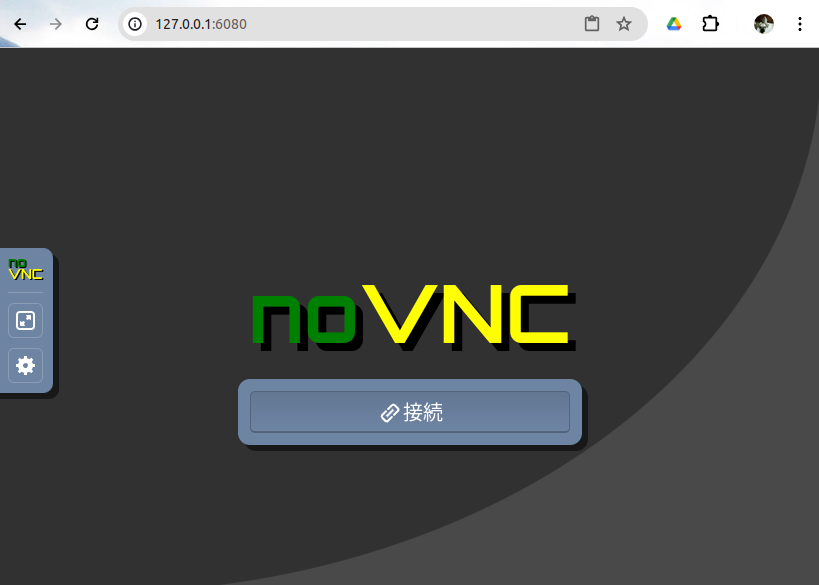
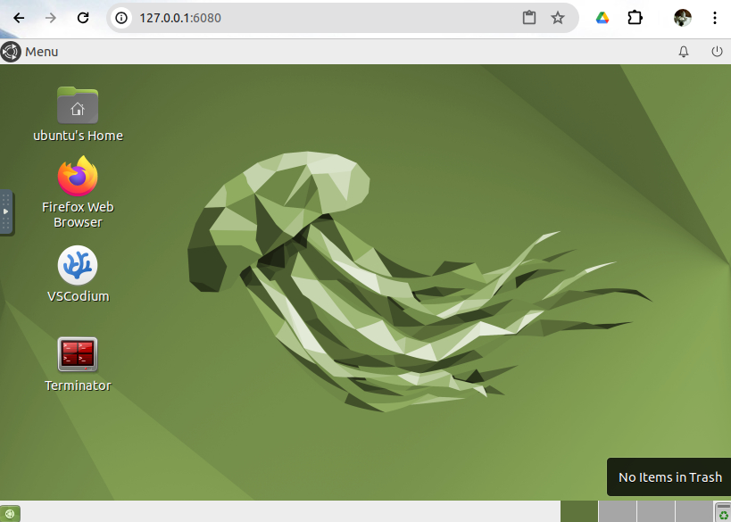

本ブランチは、[ros2-tms for constructionのmainブランチ](https://github.com/irvs/ros2_tms_for_construction)にあがっているプログラムをdocker上でも実行可能にしたものです。一部コマンドがmainブランチで説明したものと異なるので、"環境構築"と"Demo"の部分のみ、こちらのReadMeにて説明します

使用方法は以下のとおりです。

## 環境構築

### コンテナの作成
以下の手順でDockerFileからDockerイメージをビルドしてください。
```
cd && git clone -b develop/docker-model  https://github.com/irvs/ros2_tms_for_construction.git
cd ros2_tms_for_construction
sudo docker build --no-cache -t ros2_tms_for_construction -f DockerFile .
```

### コンテナの実行と表示
```
sudo docker run --privileged -p 6080:80 -p 10000:10000 --shm-size=512m -v /etc/localtime:/etc/localtime:ro -v /etc/timezone:/etc/timezone:ro -it ros2_tms_for_construction
```
上記コマンドを実行した状態で、ブラウザを開いて http://127.0.0.1:6080/ にアクセスしてください。すると以下の画面が表示されるので"接続"をクリックしてください。



すると以下のようにコンテナ内で作業することができます。



## Demo

ここでは、mainブランチで紹介されているデモの内、4 ~ 7 についてご紹介します。 詳細は以下のリンク先に記載のとおりです。実行に際し、コンテナ内で開いた各々の端末上では最初に以下のコマンドを実行してください。

 ```
 cd ~/ros2-tms-for-construction_ws
 source install/setup.bash
 ```

 4. [Try running the task schedular](CHAPTER4.md)
 5. [Try running the task schedular with OperaSim-PhysX](CHAPTER5.md)
 6. [Insert new task data to tms_db](CHAPTER6.md)
 7. [How to update parameters in mongodb based on topics from sensing pc.](CHAPTER7.md)

## Acknowledgement

This Dockerfile is based on [Tiryoh/docker-ros2-desktop-vnc](https://github.com/Tiryoh/docker-ros2-desktop-vnc), licensed under the Apache License 2.0.


