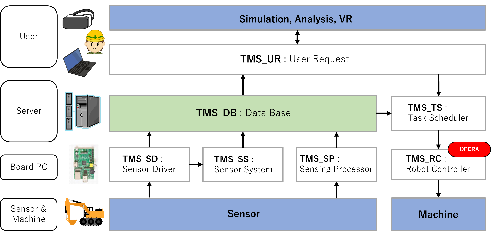
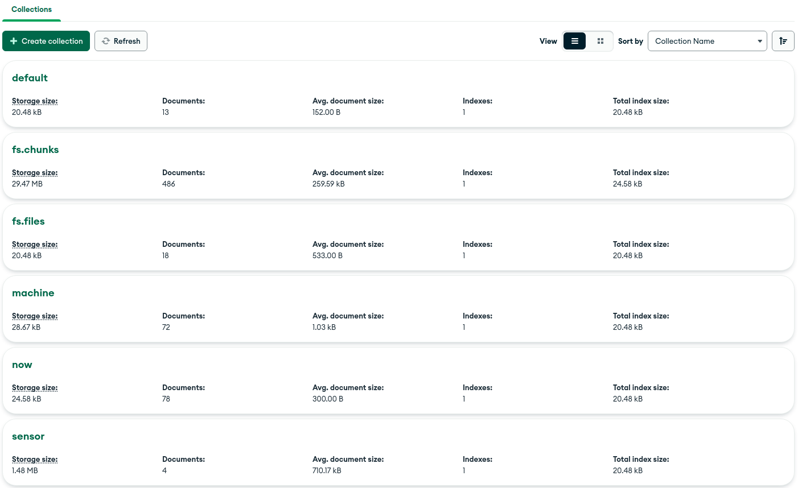

# ROS2-TMS-FOR-CONSTRUCTION

ROS2-TMS-FOR-CONSTRUCTION is an IoRT library for construction applications based on ROS2-TMS.

https://github.com/irvs/ros2_tms_for_construction/assets/63947554/d7fb02dd-37d9-4d72-aa2c-a2c2d6f7824a

## ROS2-TMS

ROS2-TMS is an IoRT (Internet of Robotic Things) library for TMS (Town Management System), which is the management system of an informationally structured environment (ISE). ROS2-TMS is newly constructed on the basis of [ROS-TMS](https://github.com/irvs/ros_tms/wiki) and adopts the state-of-the-art robot middleware, ROS2. This system integrates various information gathered by distributed sensors, stores them to an on-line database, plans proper service tasks, and manages and executes robot motion.

Wiki page : [https://github.com/irvs/ros2_tms/wiki/ROS2-TMS](https://github.com/irvs/ros2_tms/wiki/ROS2-TMS)

ROS2-TMS is being developed as a part of "**MyIoT Store**" in "**MyIoT Project**" supported by the Cabinet Office (CAO), **Cross-ministerial Strategic Innovation Promotion Program (SIP)**, “An intelligent knowledge processing infrastructure, integrating physical and virtual domains” (funding agency: NEDO).

## ROS2-TMS-FOR-CONSTRUCTION

ROS2-TMS-FOR-CONSTRUCTION is developed as an IoRT library for construction applications based on ROS2-TMS with the support of JST Moonshot R&D, Grant Number JPMJPS2032 entitled “Collaborative AI robots for adaptation of diverse environments and innovation of infrastructure construction” in “Moonshot Goal 3: Realization of Artificial Intelligence (AI) robots that autonomously learn, adapt to their environment, evolve itself in intelligence, and act alongside human beings, by 2050.”

Project page: [https://moonshot-cafe-project.org/en/](https://moonshot-cafe-project.org/en/)

### Architecture



## Install

### ROS2 Humble

https://docs.ros.org/en/humble/Installation/Alternatives/Ubuntu-Development-Setup.html

### Git

https://git-scm.com/book/en/v2/Getting-Started-Installing-Git

### MongoDB

https://www.mongodb.com/docs/v6.0/tutorial/install-mongodb-on-ubuntu/

### MongoDB Compass

https://www.mongodb.com/docs/compass/current/install/


### Related packages for ROS2-TMS-FOR-CONSTRUCTION
- pymongo 4.3.3
- open3d 0.16.0
- numpy 1.22.3
- catkin-pkg 0.5.2
- empy 3.3.4
- lark 1.1.3
- setuptools 58.2.0
- numpy-quaternion 2022.4.3

```
python3 -m pip install -r requirements.txt
```

## Setup

### Create a workspace

```
mkdir -p ~/ros2-tms-for-constructoin_ws/src
```

### Clone this repository

```
cd ~/ros2-tms-for-constructoin_ws/src/
git clone https://github.com/irvs/ros2_tms_for_construction.git
```

### Build the workspace

```
cd ~/ros2-tms-for-constructoin_ws
colcon build
```

### Setup MongoDB
```
sudo systemctl start mongod
cd ~/ros2-tms-for-constructoin_ws/src/ros2_tms_for_construction/demo
unzip rostmsdb_collections.zip
cd rostmsdb_collections/
mongoimport --db rostmsdb --collection default --file rostmsdb.default.json --jsonArray
mongoimport --db rostmsdb --collection fs.chunks  --file rostmsdb.fs.chunks.json --jsonArray
mongoimport --db rostmsdb --collection machine --file rostmsdb.machine.json --jsonArray
mongoimport --db rostmsdb --collection now --file rostmsdb.now.json --jsonArray
mongoimport --db rostmsdb --collection sensor --file rostmsdb.sensor.json --jsonArray
mongoimport --db rostmsdb --collection fs.files --file rostmsdb.fs.files.json --jsonArray
mongoimport --db rostmsdb --collection parameter --file rostmsdb.parameter.json --jsonArray
mongoimport --db rostmsdb --collection parameter --file rostmsdb.parameter.json --jsonArray
mongoimport --db rostmsdb --collection task --file rostmsdb.task.json --jsonArray
cd .. && rm -rf  rostmsdb_collections
```


## How to use

ROS2-TMS-FOR-CONSTRUCTION has the following packages. You can see detail descriptions from the links.

### tms_db

-  [tms_db_manager](tms_db/tms_db_manager)

   ROS2-TMS database manager. This package has tms_db_reader(_gridfs) and tms_db_writer(_gridfs) nodes.

### tms_sd

- [tms_sd_ground](tms_sd/tms_sd_ground)

  tms_sd_ground is a package for formatting OccupancyGrid msg to Tmsdb msg and sending it to tms_db_writer.

  The received OccupancyGrid msg is a heatmap showing the hardness of the ground.

- [tms_sd_terrain](tms_sd/tms_sd_terrain)

  tms_sd_terrain is a package for handling point cloud data of static and dynamic terrain.

  The received PointCloud2 msg is a point cloud data of terrain.

  Static terrain refers to terrain that does not change during construction operations. And dynamic terrain refers to terrain that changes during construction work.

- [tms_sd_theta](tms_sd/tms_sd_theta/)

  tms_sd_theta is a package for formatting CompressedImage msg to Tmsdb msg and sending it to tms_db_writer.

  The received CompressedImage msg is the jpeg image taken by a 360-degree camera.  

### tms_sp

- [tms_sp_machine](tms_sp/tms_sp_machine/)

  tms_sp_machine is a package for handling data realated to construction machines.

  - [tms_sp_sensing](tms_sp/tms_sp_sensing/)

  tms_sp_sensing is a package  to update dynamic parameters stored in mongoDB based on ros topic sent from another pc.

### tms_ss

- [tms_ss_terrain_static](tms_ss/tms_ss_terrain_static)

  tms_ss_terrain_static is a package for handling point cloud data of static terrain.

  The received PointCloud2 msg is a point cloud data of terrain.

### tms_tf

- [tms_tf_gui](tms_tf/tms_tf_gui/)

  tms_tf_gui is a package for transforming construction data (ex. machine's location, terrain and hardness of ground) using GUI tools.

### tms_ts
- [tms_ts_launch](tms_ts/tms_ts_launch/)
  
  tms_ts_launch_ts is a  package for specifying and executing tasks to run the actual construction machinery.
  

- [tms_ts_subtask](tms_ts/tms_ts_subtask/)

  tms_ts_subtask is a package included in subtasks.
  
  If you want to implement new subtasks, please refer programs in the tms_ts_subtask directory.

### tms_ur

- [tms_ur_button_input](tms_ur/tms_ur_button_input)

  tms_ur_button_input is a package package that searches data in mongodb for the corresponding task when the GUI button is pressed, and passes the corresponding task sequence to the task scheduler.

## Demo

The following demonstrations are presented here.

1. [Store data](#1-store-data)
2. [Get stored data](#2-get-stored-data)
3. [Store and get data simultaneously in real-time](#3-store-and-get-data-simultaneously-in-real-time)
4. [Try running the task schedular](#4-try-running-the-task-schedular)

Before demonstration, change directory and setup this workspace.

```
cd ~/ros2-tms-for-constructoin_ws
source install/setup.bash
```

You need to setup the workspace on each terminal before running the commands described in the following demonstrations.

### 1. Store data

At first, you need to store static terrain data in MongoDB with running the following commands.

#### Launch

Please run the following commands in separate terminals.

```
# MongoDB manager
ros2 launch tms_db_manager tms_db_writer.launch.py init_db:=true

# Terrain
ros2 launch tms_sd_terrain tms_sd_terrain_launch.py input/terrain/static/pointcloud2:=/demo2/terrain/static

# Static terrain
ros2 launch tms_ss_terrain_static tms_ss_terrain_static_launch.py filename:=demo.pcd filename_mesh:=demo.ply filename_dem:=demo.npy voxel_size:=0.1 octree_depth:=8 density_th:=0.1 fill_nan_type:=avg resolution:=0.1
```

#### Play rosbag

```
ros2 bag play -l ./src/ros2_tms_for_construction/demo/demo2/rosbag2_1
```

If the following message appears on the terminal where tms_sd_terrain is executed, stop the terminal playing rosbag.

```
Static terrain info was received!
```

Then, run the following commands to store other data in MongoDB.

#### Launch

```
# Odometry
ros2 launch tms_sp_machine tms_sp_machine_odom_launch.py input/odom:=/demo2/odom machine_name:=demo_machine

# Ground 2D map
ros2 launch tms_sd_ground tms_sd_ground_launch.py input/occupancy_grid:=/demo2/map_2d ground_name:=demo_ground

# Terrain
ros2 launch tms_sd_terrain tms_sd_terrain_launch.py input/terrain/dynamic/pointcloud2:=/demo2/terrain/dynamic
```

#### Play rosbag

```
ros2 bag play ./src/ros2_tms_for_construction/demo/demo2/rosbag2_2
```

After the end of rosbag, please check whether the data is stored to fs.chunks, fs.files, machine and sensor collection in your MongoDB.

GUI tool of MongoDB like a MongoDB Compass is easy to check them.

Here is an example. It may be a little different than yours, but as long as it is roughly the same, you should be fine.


### 2. Get stored data

Run the following commands to get data from MongoDB.

#### Launch

```
# MongoDB manager
ros2 launch tms_db_manager tms_db_reader.launch.py

# Get static terrain
ros2 launch tms_ur_construction tms_ur_construction_terrain_static_launch.py filename:=demo.pcd voxel_size:=0.0

# Service Client and Publisher node for static terrain data
ros2 run tms_ur_test tms_ur_construction_terrain_static_test

# Get odometry, ground 2D map and terrain data
ros2 launch tms_ur_construction tms_ur_construction_launch.py machine_name:=demo_machine
```

#### Rviz2

```
rviz2 -d ./src/ros2_tms_for_construction/demo/demo2/demo2.rviz
```

Rviz will show odometry, ground 2D map and terrain data.

Since static terrain data is large, it's may be better to stop the terminal execting tms_ur_test if static terrain is displayed on Rviz.

https://user-images.githubusercontent.com/63947554/220530548-b2e1c23c-2938-4b8f-b8f7-60b93b46f702.mp4

### 3. Store and get data simultaneously in real-time

Run the following commands to store data in MongoDB and get the data.

Static terrain data is not included because it does not need to be acquired in real-time.

#### Launch

```
# MongoDB manager
ros2 launch tms_db_manager tms_db_manager.launch.py

# Odometry
ros2 launch tms_sp_machine tms_sp_machine_odom_launch.py input/odom:=/demo2/odom machine_name:=demo_machine

# Ground 2D map
ros2 launch tms_sd_ground tms_sd_ground_launch.py input/occupancy_grid:=/demo2/map_2d ground_name:=demo_ground

# Terrain
ros2 launch tms_sd_terrain tms_sd_terrain_launch.py input/terrain/dynamic/pointcloud2:=/demo2/terrain/dynamic
```

#### Rviz2

```
rviz2 -d ./src/ros2_tms_for_construction/demo/demo2/demo2.rviz
```

#### Launch tms_ur_construction

Run the following commands to get data from MongoDB.

```
# Get static terrain
ros2 launch tms_ur_construction tms_ur_construction_terrain_static_launch.py filename:=demo.pcd voxel_size:=0.0

# Service Client and Publisher nodes for static terrain data
ros2 run tms_ur_test tms_ur_construction_terrain_static_test

# Get odometry, ground 2D map and terrain data
ros2 launch tms_ur_construction tms_ur_construction_launch.py machine_name:=demo_machine latest:=true
```

#### Play rosbag

```
ros2 bag play -l ./src/ros2_tms_for_construction/demo/demo2/rosbag2_2
```

Rviz will show odometry, ground 2D map and dynamic terrain data like a example of [2. Get stored data](#2-get-stored-data), excluding static terrain.

After the end of rosbag, please check whether the data is stored to fs.chunks, fs.files, machine and sensor collection in your MongoDB.

GUI tool of MongoDB like a MongoDB Compass is easy to check them.

Here is an example. It may be a little different than yours, but as long as it is roughly the same, you should be fine.


### 4. Try running the task schedular

To successfully run the task scheduler, mongodb must be started by executing the following command.

```
sudo systemctl start mongod
``` 

To run the task scheduler, make sure that the default collection and now collection are placed under rostmsdb database in MongoDB as shown in the following image.




Once you have verified that MongoDB looks like the image above, execute the following command.

```
cd ~/ros2-tms-for-constructoin_ws
source install/setup.bash
ros2 launch tms_ts_launch tms_ts_construction.launch.py
```

The following GUI button will then be activated.


When this button is pressed, the corresponding task is read from the mongodb and the Behavior Tree executes subtasks based on the corresponding task sequence.

You can check the runtime and the structure of the Behavior Tree using Groot as follows. Groot displays the subtasks that have been completed with colors as follows.

Follow the instructions on the official page below for how to start groot.

> **Note**
> 
> Groot can only make the Tree visible when the Behavior Tree is running. The settings for use should be as follows.
> 
> ・ Sensing IP : localhost
> 
> ・ Publisher Port : 1666 
> 
> ・ Sever Port : 1667
> 
> After setting up, press the connect button to display the Behavior tree on Groot as shown in the figure below.


### 5. Try running the task schedular with OperaSim-PhysX

This chapter explain how to link ROS2-TMS-for-construction and OperaSim-PhysX , which is being developed by PWRI.

Please follow the instructions in the ReadMe document on the official github page (URL: https://github.com/pwri-opera/OperaSim-PhysX) on how to set up windows PC for using OperaSimPhysX.

The setup procedure for an Ubuntu22.04 PC is as follows.

First, run the following commands to enable the ros-tcp-endpoint to run in your environment.

```
cd ~/ros2-tms-for-constructoin_ws/src
git clone -b dev-ros2 https://github.com/Unity-Technologies/ROS-TCP-Endpoint.git
cd ..
colcon build --packages-select ros_tcp_endpoint && source install/setup.bash
```

Make sure there are no build errors and run ros_tcp_endpoint by executing the following command.

```
ros2 launch ros_tcp_endpoint endpoint.py
```
Then ros_tcp_ednpoint will start on ubuntu22.04 PC.

Then follow the connection procedure in the OperaSim-Phyx ReadMe document (URL: https://github.com/pwri-opera/OperaSim-PhysX) to set up the ros-tcp-endpoint.

Now, if you follow the steps in chapter 4 to configure ROS2-TMS-for-construction, you can see the zx120 on OperaSim-PhysX running as follows.


Of course, you can also use Groot to monitor the tasks being performed by the Behavior Tree while the Task Scheduler is running, as shown in the following video.


https://github.com/irvs/ros2_tms_for_construction/assets/130209264/8747df87-0dd9-42c4-9132-6454c15eeedf


### 6. Insert new data to tms_db

## Version Information

* Date : 2022.8.19 (since 2022.8.19 ROS2-TMS-FOR-CONSTRUCTION / since 2019.2.14 ROS2-TMS / since 2012.5.1 ROS-TMS / since 2005.11.1 TMS)  

* Ubuntu 22.04 LTS 64BIT  

* ROS2 Humble Hawksbill : https://docs.ros.org/en/humble/Installation.html   

* mongodb 6.0  

* pymongo 4.3.3

* open3d 0.16.0

* numpy 1.22.3

* catkin-pkg 0.5.2

* empy 3.3.4

* lark 1.1.3

* setuptools 58.2.0

* numpy-quaternion 2022.4.3
