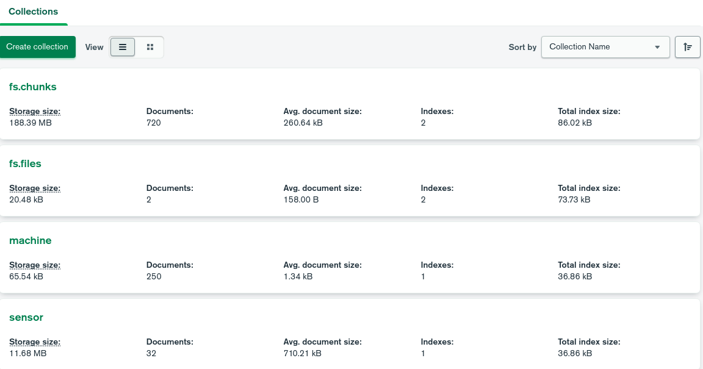
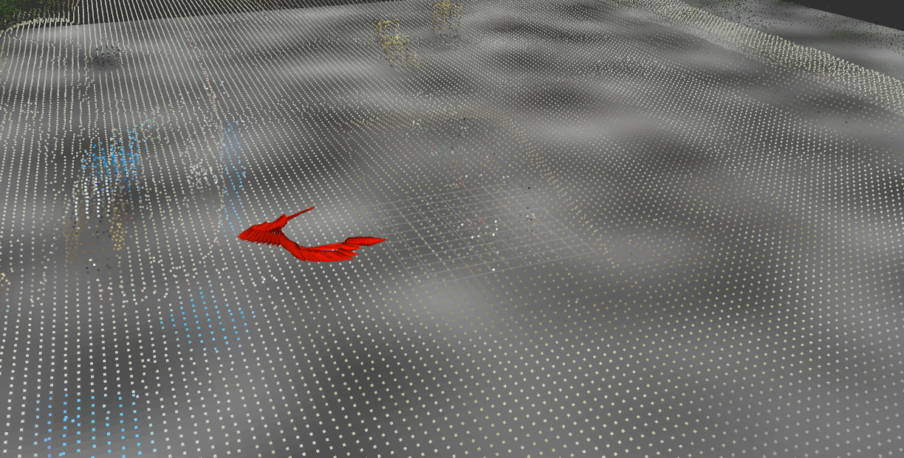

# ROS2-TMS-FOR-CONSTRUCTION

ROS2-TMS-FOR-CONSTRUCTION is an IoRT library for construction applications based on ROS2-TMS.

## ROS2-TMS

ROS2-TMS is an IoRT (Internet of Robotic Things) library for TMS (Town Management System), which is the management system of an informationally structured environment (ISE). ROS2-TMS is newly constructed on the basis of [ROS-TMS](https://github.com/irvs/ros_tms/wiki) and adopts the state-of-the-art robot middleware, ROS2. This system integrates various information gathered by distributed sensors, stores them to an on-line database, plans proper service tasks, and manages and executes robot motion.

Wiki page : [https://github.com/irvs/ros2_tms/wiki/ROS2-TMS](https://github.com/irvs/ros2_tms/wiki/ROS2-TMS)

ROS2-TMS is being developed as a part of "**MyIoT Store**" in "**MyIoT Project**" supported by the Cabinet Office (CAO), **Cross-ministerial Strategic Innovation Promotion Program (SIP)**, “An intelligent knowledge processing infrastructure, integrating physical and virtual domains” (funding agency: NEDO).

## ROS2-TMS-FOR-CONSTRUCTION

ROS2-TMS-FOR-CONSTRUCTION is developed as an IoRT library for construction applications based on ROS2-TMS with the support of JST Moonshot R&D, Grant Number JPMJPS2032 entitled “Collaborative AI robots for adaptation of diverse environments and innovation of infrastructure construction” in “Moonshot Goal 3: Realization of Artificial Intelligence (AI) robots that autonomously learn, adapt to their environment, evolve itself in intelligence, and act alongside human beings, by 2050.”

Project page: [https://moonshot-cafe-project.org/en/](https://moonshot-cafe-project.org/en/)

## Install

### ROS2 Foxy

https://docs.ros.org/en/foxy/Installation/Alternatives/Ubuntu-Development-Setup.html

### Git

https://git-scm.com/book/en/v2/Getting-Started-Installing-Git

### MongoDB

https://www.mongodb.com/docs/v5.0/tutorial/install-mongodb-on-ubuntu/

### Related packages for ROS2-TMS-FOR-CONSTRUCTION
- pymongo 4.2.0
- open3d 0.15.2
- numpy 1.22.3
- catkin-pkg 0.5.2
- empy 3.3.4
- lark 1.1.3

```
python3 -m pip install pymongo==4.2.0 open3d==0.15.2 numpy==1.22.3 catkin-pkg==0.5.2 empy==3.3.4 lark==1.1.3
```


## Setup

### Create a workspace

```
mkdir -p ~/ros2-tms-for-constructoin_ws/src
```

### Clone this repository

```
cd ~/ros2-tms-for-constructoin_ws/src/
git clone　https://github.com/irvs/ros2_tms_for_construction.git
```

### Build the workspace

```
cd ~/ros2-tms-for-constructoin_ws
colcon build
```

## How to use

ROS2-TMS-FOR-CONSTRUCTION has the following packages. You can see detail descriptions from the links.

### tms_db

-  [tms_db_manager](tms_db/tms_db_manager)

   ROS2-TMS database manager. This package has tms_db_reader(_gridfs) and tms_db_writer(_gridfs) nodes.

### tms_mc

- [tms_mc_odom](tms_mc/tms_mc_odom)

  tms_mc_odom is a package for formatting Odometry msg to Tmsdb msg and sending it to tms_db_writer.

  The received Odometry msg is the location data of the construction machine.

### tms_sd

- [tms_sd_ground](tms_sd/tms_sd_ground)

  tms_sd_ground is a package for formatting OccupancyGrid msg to Tmsdb msg and sending it to tms_db_writer.

  The received OccupancyGrid msg is a heatmap showing the hardness of the ground.

- [tms_sd_terrain](tms_sd/tms_sd_terrain)

  tms_sd_terrain is a package for converting PointCloud2 msg to .pcd file and sending the file info to tms_db_writer_gridfs.

  The received PointCloud2 msg is a point cloud data of terrain.

### tms_ur

- [tms_ur_construction](tms_ur/tms_ur_construction)

  tms_ur_construction is a package for getting construction data (ex. machine's location, terrain, hardness of ground) from tms_db_reader(_gridfs) and publishing them.

## Demo

Three demonstration are presented here.

1. [Store data](#1-store-data)
2. [Get stored data](#2-get-stored-data)
3. [Store and get data](#3-store-and-get-data)

Before demonstration, change directory and setup this workspace.

```
cd ~/ros2-tms-for-constructoin_ws
source install/setup.bash
```

### 1. Store data

Run the following commands to save data in MongoDB.

#### Launch

```
# MongoDB manager
ros2 launch tms_db_manager tms_db_writer.launch.py init_db:=true

# Odometry
ros2 launch tms_mc_odom tms_mc_odom_launch.py input/odom:=/demo/odom machine_name:=demo_machine

# OccupancyGrid
ros2 launch tms_sd_ground tms_sd_ground_launch.py input/occupancy_grid:=/demo/occupancy_grid ground_name:=demo_ground

# PointCloud2
ros2 launch tms_sd_terrain tms_sd_terrain_launch.py input/pointcloud2:=/demo/pointcloud2 filename:=demo.pcd
```

#### Play rosbag

```
ros2 bag play ./src/ros2_tms_for_construction/demo/rosbag
```

After the end of rosbag, please check whether the data is stored to fs.chunks, fs.files, machine and sensor collection in your MongoDB.

GUI tool of MongoDB like a MongoDB Compass is easy to check them.

Here is an example. It may be a little different than yours, but as long as it is roughly the same, you should be fine.



### 2. Get stored data

Please try this demonstration after [1. Store data](#1-store-data).

Run the following commands to get data from MongoDB.

#### Launch

```
# MongoDB manager
ros2 launch tms_db_manager tms_db_reader.launch.py

# Get Odometry, OccupancyGrid and PointCloud2 message
ros2 launch tms_ur_construction tms_ur_construction_launch.py filename:=demo.pcd voxel_size:=0.5
```

#### Rviz2

```
rviz2 -d ./src/ros2_tms_for_construction/demo/demo.rviz
```

Rviz2 will show Odometry, OccupancyGrid and PointCloud2 topics.



### 3. Store and get data

Run the following commands to store data in MongoDB and get the data.

#### Launch

```
# MongoDB manager
ros2 launch tms_db_manager tms_db_manager.launch.py init_db:=true

# Odometry
ros2 launch tms_mc_odom tms_mc_odom_launch.py input/odom:=/demo/odom machine_name:=demo_machine

# OccupancyGrid
ros2 launch tms_sd_ground tms_sd_ground_launch.py input/occupancy_grid:=/demo/occupancy_grid ground_name:=demo_ground

# PointCloud2
ros2 launch tms_sd_terrain tms_sd_terrain_launch.py input/pointcloud2:=/demo/pointcloud2 filename:=demo.pcd
```

#### Rviz2

```
rviz2 -d ./src/ros2_tms_for_construction/demo/demo.rviz
```

#### Play rosbag

```
ros2 bag play ./src/ros2_tms_for_construction/demo/rosbag
```

#### Launch tms_ur_construction

After the tms_sd_terrain node was finished (PointCloud2 was stored to MongoDB), run the following command. 

```
ros2 launch tms_ur_construction tms_ur_construction_launch.py filename:=demo.pcd voxel_size:=0.5 latest:=true
```

Rviz2 will show Odometry, OccupancyGrid and PointCloud2 topics.


After the end of rosbag, please check whether the data is stored to fs.chunks, fs.files, machine and sensor collection in your MongoDB.

GUI tool of MongoDB like a MongoDB Compass is easy to check them.

Here is an example. It may be a little different than yours, but as long as it is roughly the same, you should be fine.


## Version Information

* Date : 2022.8.19 (since 2022.8.19 ROS2-TMS-FOR-CONSTRUCTION / since 2019.2.14 ROS2-TMS / since 2012.5.1 ROS-TMS / since 2005.11.1 TMS)  
  
* Url : https://index.ros.org/doc/ros2/Installation/Foxy/     

* Ubuntu 20.04 LTS 64BIT  

* ROS2 Foxy Fitzroy  

* mongodb 5.0  

* pymongo 4.2.0  

* open3d 0.15.2

* numpy 1.22.3

* catkin-pkg 0.5.2

* empy 3.3.4

* lark 1.1.3