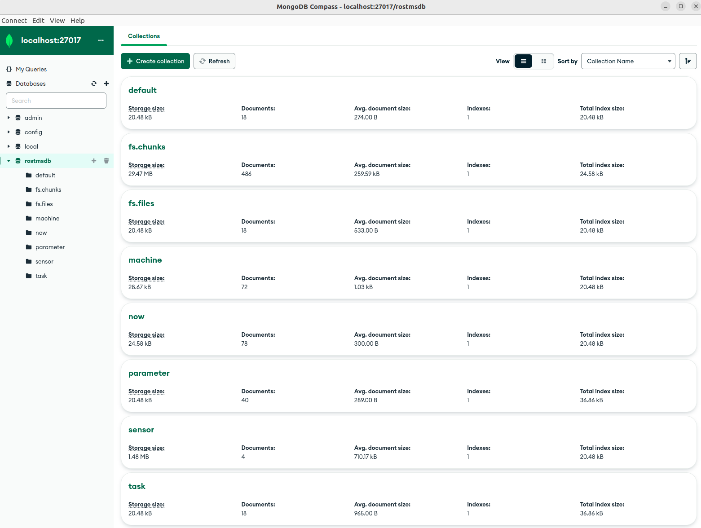
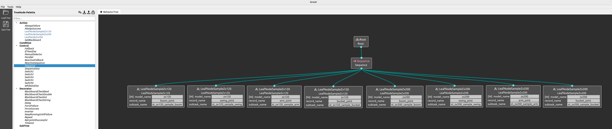

# ROS2-TMS-FOR-CONSTRUCTION

ROS2-TMS-FOR-CONSTRUCTION is an IoRT library for construction applications based on ROS2-TMS.

https://github.com/irvs/ros2_tms_for_construction/assets/63947554/d7fb02dd-37d9-4d72-aa2c-a2c2d6f7824a

## ROS2-TMS

ROS2-TMS is an IoRT (Internet of Robotic Things) library for TMS (Town Management System), which is the management system of an informationally structured environment (ISE). ROS2-TMS is newly constructed on the basis of [ROS-TMS](https://github.com/irvs/ros_tms/wiki) and adopts the state-of-the-art robot middleware, ROS2. This system integrates various information gathered by distributed sensors, stores them to an on-line database, plans proper service tasks, and manages and executes robot motion.

Wiki page : [https://github.com/irvs/ros2_tms/wiki/ROS2-TMS](https://github.com/irvs/ros2_tms/wiki/ROS2-TMS)

ROS2-TMS is being developed as a part of "**MyIoT Store**" in "**MyIoT Project**" supported by the Cabinet Office (CAO), **Cross-ministerial Strategic Innovation Promotion Program (SIP)**, “An intelligent knowledge processing infrastructure, integrating physical and virtual domains” (funding agency: NEDO).

## ROS2-TMS-FOR-CONSTRUCTION

ROS2-TMS-FOR-CONSTRUCTION is developed as an IoRT library for construction applications based on ROS2-TMS with the support of JST Moonshot R&D, Grant Number JPMJPS2032 entitled “Collaborative AI robots for adaptation of diverse environments and innovation of infrastructure construction” in “Moonshot Goal 3: Realization of Artificial Intelligence (AI) robots that autonomously learn, adapt to their environment, evolve itself in intelligence, and act alongside human beings, by 2050.”

Project page: [https://moonshot-cafe-project.org/en/](https://moonshot-cafe-project.org/en/)

### Architecture


## Install

### ROS2 Humble

https://docs.ros.org/en/humble/Installation/Alternatives/Ubuntu-Development-Setup.html

### Git

https://git-scm.com/book/en/v2/Getting-Started-Installing-Git

### MongoDB

https://www.mongodb.com/docs/v6.0/tutorial/install-mongodb-on-ubuntu/

### MongoDB Compass

https://www.mongodb.com/docs/compass/current/install/


### Related packages for ROS2-TMS-FOR-CONSTRUCTION
- pymongo 4.3.3
- open3d 0.16.0
- numpy 1.22.3
- catkin-pkg 0.5.2
- empy 3.3.4
- lark 1.1.3
- setuptools 58.2.0
- numpy-quaternion 2022.4.3


## Setup

### Create a workspace

```
cd
mkdir -p ~/ros2-tms-for-construction_ws/src
```

### Clone this repository

```
cd ~/ros2-tms-for-construction_ws/src
git clone https://github.com/irvs/ros2_tms_for_construction.git -b develop/ts # modify if this is the other branch
```


### Install required python packages
```
cd ~/ros2-tms-for-construction_ws/src/ros2_tms_for_construction
python3 -m pip install -r requirements.txt
```

### Setup MongoDB

> **Note**
> If a rostmsdb database already exists on mongodb, an error will occur during the execution of the following command. In such a case, delete the rostmsdb database in your environment and then execute the following command.


```
sudo systemctl start mongod
cd ~/ros2-tms-for-construction_ws/src/ros2_tms_for_construction/demo
unzip rostmsdb_collections.zip
mongorestore dump
```

## Setup BehaviorTree.CPP

```
sudo apt install libzmq3-dev libboost-dev libncurses5-dev libncursesw5-dev
cd
git clone --branch v3.8 https://github.com/BehaviorTree/BehaviorTree.CPP.git
cd BehaviorTree.CPP
mkdir build; cd build
cmake ..
make
sudo make install
cd && rm -rf BehaviorTree.CPP
```

### Setup mongocxx / bsoncxx

```
cd
wget https://github.com/mongodb/mongo-c-driver/releases/download/1.24.4/mongo-c-driver-1.24.4.tar.gz
tar -xzf mongo-c-driver-1.24.4.tar.gz
cd mongo-c-driver-1.24.4
mkdir cmake-build
cd cmake-build
cmake -DENABLE_AUTOMATIC_INIT_AND_CLEANUP=OFF .. -DCMAKE_INSTALL_PREFIX=/usr/local
sudo make install

cd
curl -OL https://github.com/mongodb/mongo-cxx-driver/releases/download/r3.8.1/mongo-cxx-driver-r3.8.1.tar.gz
tar -xzf mongo-cxx-driver-r3.8.1.tar.gz
cd mongo-cxx-driver-r3.8.1/build
cmake .. -DCMAKE_BUILD_TYPE=Release -DCMAKE_INSTALL_PREFIX=/usr/local -DBSONCXX_POLY_USE_BOOST=1 -DMONGOCXX_OVERRIDE_DEFAULT_INSTALL_PREFIX=OFF
cmake --build .
sudo cmake --build . --target install

export LD_LIBRARY_PATH=/usr/local/lib:$LD_LIBRARY_PATH
echo 'export LD_LIBRARY_PATH=/usr/local/lib:$LD_LIBRARY_PATH' >> ~/.bashrc
cd && rm -rf mongo-c-driver-1.24.4 mongo-c-driver-1.24.4.tar.gz mongo-cxx-driver-r3.8.1 mongo-cxx-driver-r3.8.1.tar.gz
```

### Setup Groot
```
sudo apt install qtbase5-dev libqt5svg5-dev libzmq3-dev libdw-dev
cd ~/ros2-tms-for-construction_ws/src && git clone https://github.com/BehaviorTree/Groot.git
cd .. && colcon build --packages-select groot
./build/groot/Groot
```

### Install nlohmann-json library
```
sudo apt install nlohmann-json3-dev
```

### Setup OPERA
```
# Install dbcppp
cd && git clone --recurse-submodules https://github.com/genkiiii/dbcppp.git
cd dbcppp && mkdir build && cd build

# Install caranry
cd && git clone https://github.com/djarek/canary.git
cd canary && mkdir build && cd build
cmake ..
sudo make install

# Install rttr
sudo apt install doxygen
https://github.com/irvs/rttr.git # This package is a private repository. Please wait a while until it is made public.
cd rttr && mkdir build && cd build
cmake ..
sudo make install
echo 'export RTTR_DIR=/home/common/rttr/build/install/' >> ~/.bashrc
source ~/.bashrc

# Install common packages for OPERA
cd ~/ros2-tms-for-construction_ws/src/opera/common
git clone https://github.com/pwri-opera/com3
git clone https://github.com/pwri-opera/com3_ros.git

# Install the package for OperaSim-PhysX
cd .. && mkdir simulator && cd simulator
git clone -b main-ros2 https://github.com/Unity-Technologies/ROS-TCP-Endpoint.git

# Install packages for OPERA-compatible backhoe ZX200
cd .. && mkdir zx200 && cd zx200
git clone -b develop/top https://github.com/irvs/tms_if_for_opera.git
git clone https://github.com/irvs/excavator_ik.git
git clone https://github.com/pwri-opera/zx200_ros2.git

# Install packages for OPERA-compatible crawler dump IC120
cd .. && mkdir ic120 && cd ic120
git clone https://github.com/pwri-opera/ic120_ros2.git  # This package is a private repository. Please wait a while until it is made public.
git clone https://github.com/pwri-opera/gnss_localizer_ros2.git   # This package is a private repository. Please wait a while until it is made public.
git clone https://github.com/pwri-opera/ic120_com3_ros.git  # This package is a private repository. Please wait a while until it is made public.
```

### Build the workspace

```
cd ~/ros2-tms-for-construction_ws
colcon build && source install/setup.bash
```


## How to use

ROS2-TMS-FOR-CONSTRUCTION has the following packages. You can see detail descriptions from the links.

### tms_db

-  [tms_db_manager](tms_db/tms_db_manager)

   ROS2-TMS database manager. This package has tms_db_reader(_gridfs) and tms_db_writer(_gridfs) nodes.

### tms_sd

- [tms_sd_ground](tms_sd/tms_sd_ground)

  tms_sd_ground is a package for formatting OccupancyGrid msg to Tmsdb msg and sending it to tms_db_writer.

  The received OccupancyGrid msg is a heatmap showing the hardness of the ground.

- [tms_sd_terrain](tms_sd/tms_sd_terrain)

  tms_sd_terrain is a package for handling point cloud data of static and dynamic terrain.

  The received PointCloud2 msg is a point cloud data of terrain.

  Static terrain refers to terrain that does not change during construction operations. And dynamic terrain refers to terrain that changes during construction work.

- [tms_sd_theta](tms_sd/tms_sd_theta/)

  tms_sd_theta is a package for formatting CompressedImage msg to Tmsdb msg and sending it to tms_db_writer.

  The received CompressedImage msg is the jpeg image taken by a 360-degree camera.  

### tms_sp

- [tms_sp_machine](tms_sp/tms_sp_machine/)

  tms_sp_machine is a package for handling data realated to construction machines.

- [tms_sp_sensing](tms_sp/tms_sp_sensing/)

  tms_sp_sensing is a package  to update dynamic parameters stored in mongoDB based on ros topic sent from another pc.

### tms_ss

- [tms_ss_terrain_static](tms_ss/tms_ss_terrain_static)

  tms_ss_terrain_static is a package for handling point cloud data of static terrain.

  The received PointCloud2 msg is a point cloud data of terrain.

### tms_tf

- [tms_tf_gui](tms_tf/tms_tf_gui/)

  tms_tf_gui is a package for transforming construction data (ex. machine's location, terrain and hardness of ground) using GUI tools.

### tms_ts
- [tms_ts_launch](tms_ts/tms_ts_launch/)
  
  tms_ts_launch_ts is a  package for specifying and executing tasks to run the actual construction machinery.
  

- [tms_ts_subtask](tms_ts/tms_ts_subtask/)

  tms_ts_subtask is a package included in subtasks.
  
  If you want to implement new subtasks, please refer programs in the tms_ts_subtask directory.

- [tms_ts_manager](tms_ts/tms_ts_manager/)

  tms_ts_manager is a package that contains the main program of task schedular.

- [sensing_msgs](tms_ts/sensing_msgs/)
  
  sensing_msgs is a package that contains .msg files for sensing process.

### tms_ur

- [tms_ur_button_input](tms_ur/tms_ur_button_input)

  tms_ur_button_input is a package that searches data in mongodb for the corresponding task when the GUI button is pressed, and passes the corresponding task sequence to the task scheduler.

## Demo

The following demonstrations are presented here.

1. [Store data](#1-store-data)
2. [Get stored data](#2-get-stored-data)
3. [Store and get data simultaneously in real-time](#3-store-and-get-data-simultaneously-in-real-time)
4. [Try running the task schedular](#4-try-running-the-task-schedular)
5. [Try running the task schedular with OperaSim-PhysX](#5-Try-running-the-task-schedular-with-OperaSim-PhysX)
6. [Insert new task data to tms_db](#6-Insert-new-task-data-to-tms_db)
7. [How to update parameters in mongodb based on topics from sensing pc](#7-How-to-update-parameters-in-mongodb-based-on-topics-from-sensing-pc)


Before demonstration, change directory and setup this workspace.

```
cd ~/ros2-tms-for-construction_ws
source install/setup.bash
```

You need to setup the workspace on each terminal before running the commands described in the following demonstrations.

### 1. Store data

At first, you need to store static terrain data in MongoDB with running the following commands.

#### Launch

Please run the following commands in separate terminals.

```
# MongoDB manager
ros2 launch tms_db_manager tms_db_writer.launch.py init_db:=true

# Terrain
ros2 launch tms_sd_terrain tms_sd_terrain_launch.py input/terrain/static/pointcloud2:=/demo2/terrain/static

# Static terrain
ros2 launch tms_ss_terrain_static tms_ss_terrain_static_launch.py filename:=demo.pcd filename_mesh:=demo.ply filename_dem:=demo.npy voxel_size:=0.1 octree_depth:=8 density_th:=0.1 fill_nan_type:=avg resolution:=0.1
```

#### Play rosbag

```
ros2 bag play -l ./src/ros2_tms_for_construction/demo/demo2/rosbag2_1
```

If the following message appears on the terminal where tms_sd_terrain is executed, stop the terminal playing rosbag.

```
Static terrain info was received!
```

Then, run the following commands to store other data in MongoDB.

#### Launch

```
# Odometry
ros2 launch tms_sp_machine tms_sp_machine_odom_launch.py input/odom:=/demo2/odom machine_name:=demo_machine

# Ground 2D map
ros2 launch tms_sd_ground tms_sd_ground_launch.py input/occupancy_grid:=/demo2/map_2d ground_name:=demo_ground

# Terrain
ros2 launch tms_sd_terrain tms_sd_terrain_launch.py input/terrain/dynamic/pointcloud2:=/demo2/terrain/dynamic
```

#### Play rosbag

```
ros2 bag play ./src/ros2_tms_for_construction/demo/demo2/rosbag2_2
```

After the end of rosbag, please check whether the data is stored to fs.chunks, fs.files, machine and sensor collection in your MongoDB.

GUI tool of MongoDB like a MongoDB Compass is easy to check them.

Here is an example. It may be a little different than yours, but as long as it is roughly the same, you should be fine.


### 2. Get stored data

Run the following commands to get data from MongoDB.

#### Launch

```
# MongoDB manager
ros2 launch tms_db_manager tms_db_reader.launch.py

# Get static terrain
ros2 launch tms_ur_construction tms_ur_construction_terrain_static_launch.py filename:=demo.pcd voxel_size:=0.0

# Service Client and Publisher node for static terrain data
ros2 run tms_ur_test tms_ur_construction_terrain_static_test

# Get odometry, ground 2D map and terrain data
ros2 launch tms_ur_construction tms_ur_construction_launch.py machine_name:=demo_machine
```

#### Rviz2

```
rviz2 -d ./src/ros2_tms_for_construction/demo/demo2/demo2.rviz
```

Rviz will show odometry, ground 2D map and terrain data.

Since static terrain data is large, it's may be better to stop the terminal execting tms_ur_test if static terrain is displayed on Rviz.

https://user-images.githubusercontent.com/63947554/220530548-b2e1c23c-2938-4b8f-b8f7-60b93b46f702.mp4

### 3. Store and get data simultaneously in real-time

Run the following commands to store data in MongoDB and get the data.

Static terrain data is not included because it does not need to be acquired in real-time.

#### Launch

```
# MongoDB manager
ros2 launch tms_db_manager tms_db_manager.launch.py

# Odometry
ros2 launch tms_sp_machine tms_sp_machine_odom_launch.py input/odom:=/demo2/odom machine_name:=demo_machine

# Ground 2D map
ros2 launch tms_sd_ground tms_sd_ground_launch.py input/occupancy_grid:=/demo2/map_2d ground_name:=demo_ground

# Terrain
ros2 launch tms_sd_terrain tms_sd_terrain_launch.py input/terrain/dynamic/pointcloud2:=/demo2/terrain/dynamic
```

#### Rviz2

```
rviz2 -d ./src/ros2_tms_for_construction/demo/demo2/demo2.rviz
```

#### Launch tms_ur_construction

Run the following commands to get data from MongoDB.

```
# Get static terrain
ros2 launch tms_ur_construction tms_ur_construction_terrain_static_launch.py filename:=demo.pcd voxel_size:=0.0

# Service Client and Publisher nodes for static terrain data
ros2 run tms_ur_test tms_ur_construction_terrain_static_test

# Get odometry, ground 2D map and terrain data
ros2 launch tms_ur_construction tms_ur_construction_launch.py machine_name:=demo_machine latest:=true
```

#### Play rosbag

```
ros2 bag play -l ./src/ros2_tms_for_construction/demo/demo2/rosbag2_2
```

Rviz will show odometry, ground 2D map and dynamic terrain data like a example of [2. Get stored data](#2-get-stored-data), excluding static terrain.

After the end of rosbag, please check whether the data is stored to fs.chunks, fs.files, machine and sensor collection in your MongoDB.

GUI tool of MongoDB like a MongoDB Compass is easy to check them.

Here is an example. It may be a little different than yours, but as long as it is roughly the same, you should be fine.


### 4. Try running the task schedular

In this chapter, we will explain how to use the task scheduler.
To successfully run the task scheduler, mongodb must be started by executing the following command.

```
sudo systemctl start mongod
``` 

 Before running the task scheduler, make sure that the task collection and the parameter collection are placed under rostmsdb database in MongoDB. Database verification can be done using mongodb compass. The confirmation procedure is as follows.
1. Start MongoDB Compass. The following screen will appear.
 

2. Confirm that the URI is entered as "mongodb://localhost:27017/" and press the "Connect" button. You will then see the following screen.


 3. Click on the "rostmsdb" button in the above screen, and if the screen looks like the following, the database setup is complete.


 If the database or collections does not exist, please execute the following command to add the database

```
sudo systemctl start mongod
cd ~/ros2-tms-for-construction_ws/src/ros2_tms_for_construction/demo
unzip rostmsdb_collections.zip
mongorestore dump
```


Once you have verified that MongoDB looks like the image above, execute the following command.

```
cd ~/ros2-tms-for-construction_ws
source install/setup.bash
ros2 launch tms_ts_launch tms_ts_construction.launch.py
```

The following GUI button will then be activated.


When this green button is pressed, the corresponding task is read from the mongodb and the Behavior Tree executes subtasks based on the corresponding task sequence.

The task to be executed at this time is the task data in the task collection of rostmsdb in mongodb. The number displayed to the right of the "task_id:" button is the task_id of the task data to be executed by task schedular.

**Also, the red button is for emergency stop. Press this button if you want to stop the Task Scheduler in an emergency when it is executing a task.**


Groot can be started by executing the following command.

```
cd ~/ros2-tms-for-construction_ws
./build/groot/Groot
```
After executing the above command, if Groot can be successfully started, the following screen will be output.


In the above image, "Editor" is used to generate task sequence. On the other hand, "Monitor" is used to visualize the status of running tasks.

In this section, we will show you how to visualize the status of running tasks using the "monitor" function.

First, click on the "monitor" button of the previous screen to output the following screen.

After opening the screen, check that the parameter settings on this screen are as follows


> The settings for use should be as follows.
> 
> ・ Sensing IP : localhost
> 
> ・ Publisher Port : 1666 
> 
> ・ Sever Port : 1667

After setting each parameter, click the "connect" button to see how the task is running in the behavior tree, as shown in the image below.


> **Note**
> 
> The ability to visualize tasks being executed by Groot cannot be performed unless the task is being executed by the behavior tree. 
>　So, if you want to visualize the  task sequence on Groot, you have to follow  the step below.
>
>  
>
>  If you click the above button in Groot without the behavior tree running, the following error will occur.
>  
>  

If you want to change the task to be executed, update the following parameter in ros2_tms_for_construction/tms_ts/tms_ts_launch/launch/tms_ts_construction.launch.py to the task_id value of the task you want to execute, and then execute the following.

```
cd ~/ros2-tms-for-construction_ws
colcon build --packages-select tms_ts_launch && source install/setup.bash
```


### 5. Try running the task schedular with OperaSim-PhysX

This chapter explain how to link ROS2-TMS-for-construction and OperaSim-PhysX , which is being developed by PWRI.

Please follow the instructions in the ReadMe document on the official GitHub page (URL: https://github.com/pwri-opera/OperaSim-PhysX) on how to set up windows PC and ubuntu 22.04 PC for using OperaSimPhysX.

Once the connection between OperaSim-PhysX and ROS2 Humble is established, run the following command to start ROS2-TMS-for-construction on Ubuntu22.04 PC.

```
cd ~/ros2-tms-for-construction_ws
source install/setup.bash
ros2 launch tms_ts_launch tms_ts_construction.launch.py
```

As explained in Chapter 4, you can execute the specified task using the task scheduler by clicking the green button that appears when starting ros2-tms-for-construction. If you want to make an emergency stop while executing a task, click on the red button.

Additionally, the current ROS2-TMS for Construction includes several tasks for operating construction machinery and real machines on OperaSim-PhysX, along with their respective subtasks. The contents are as follows:


Of course, you can also use Groot to monitor the tasks being performed by the Behavior Tree while the Task Scheduler is running, as shown in the following video.


https://github.com/irvs/ros2_tms_for_construction/assets/130209264/8747df87-0dd9-42c4-9132-6454c15eeedf


### 6. Insert new task data to tms_db

This section describes how to add new tasks to the database.

1. First, generate a new task sequence using Groot. When using Groot to generate a task sequence, it is necessary to register subtasks. Load the following file to make each subtask configurable.

Then the subtasks will appear in the node list section of Groot as shown in the following image.

Combining these nodes, we can create a task tree as shown below.


2. Please store the xml file of the task sequence generated using Groot under ros2_tms_for_construction/tms_ts/tms_ts_manager/config directory.The following is how to save the xml file of the task tree created in Groot.


3. Execute the following command to save the created task data to the database Replace [file_name] in the command with the filename of the xml file you created.
  ```
  cd ~/ros2-tms-for-construction_ws
  colcon build --packages-select tms_ts_manager && source install/setup.bash
  ros2 run tms_ts_manager task_generator.py --ros-args -p bt_tree_xml_file_name:=[file_name]
  ```
  For example, to store sample_construction_tree.xml in ros2_tms_for_construction/tms_ts/tms_ts_manager/config in the database as a task, run the following command.

  ```
  ros2 run tms_ts_manager task_generator.py --ros-args -p bt_tree_xml_file_name:=sample_construction_tree
  ```

4. You can see that the task just described has been added under the tasks collection in mongodb's rostmsdb database.

### 7. How to update parameters in mongodb based on topics from sensing pc

> **Note**
> The pc running cps and the sensing pc must be on the same network and they must be aligned if ROS_DOMAIN_ID is set.
> For more information for ROS_DOMAIN_ID, please refer to the official ROS documentation ( https://docs.ros.org/en/humble/Concepts/Intermediate/About-Domain-ID.html ).

1. Place the .msg file directly under the ros2-tms-for-construction_ws/tms_ts/sensing_msgs/msg directory. This .msg file represents the type of data to be stored from the sensing pc to the parameter collection in mongodb via ros2 topic.
2. After storing the .msg file in place, execute the following command.
  ```
  cd ~/ros2-tms-for-construction_ws
  colcon build --packages-select sensing_msgs tms_sp_sensing && source install/setup.bash
  ros2 run tms_sp_sensing sample
  ```
3. From then on, processing will be performed on a different ubuntu pc for sensing processing than the pc running ros2-tms-for-construction. These personal computers must be located on the same network. In this description, the sensing pc is assumed to be running Ubuntu 22.04 lts with ROS2 Humble on it.
4. Once the sensing pc is ready, open a terminal and execute the following command.
  ```
  cd 
  mkdir -p sensing_ws/src
  cd sensing_ws/src
  git clone -b master https://github.com/kasahara-san/sensing_sample_cps.git
  cd ..
  colcon build --packages-select sample_sensing_nodes sensing_msgs && source install/setup.bash
  ros2 run sample_sensing_nodes sample_publisher
  ```
5. Then you can see that the following parameter on parameter collection in mongodb change dynamically using mongodb compass. Note that when using mongodb compass to check parameter values, you must press the refresh button shown in the following image each time to reflect the latest values of the parameters on mongodb.


## Version Information

* Date : 2022.8.19 (since 2022.8.19 ROS2-TMS-FOR-CONSTRUCTION / since 2019.2.14 ROS2-TMS / since 2012.5.1 ROS-TMS / since 2005.11.1 TMS)  

* Ubuntu 22.04 LTS 64BIT  

* ROS2 Humble Hawksbill : https://docs.ros.org/en/humble/Installation.html   

* mongodb 6.0  

* pymongo 4.3.3

* open3d 0.16.0

* numpy 1.22.3

* catkin-pkg 0.5.2

* empy 3.3.4

* lark 1.1.3

* setuptools 58.2.0

* numpy-quaternion 2022.4.3
