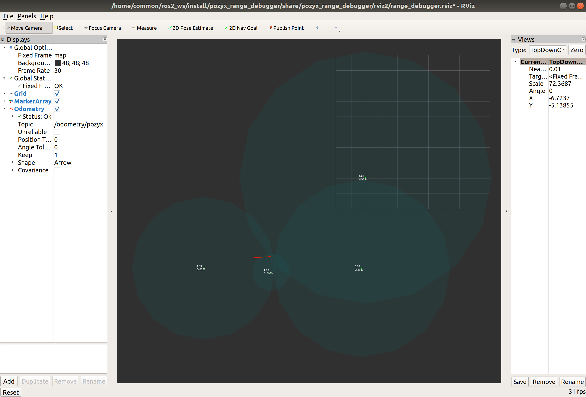

# POZYX_RANGE_DEBUGGER
ROS2 package of Pozyx positioning debugger on Rviz2



## System
* Ubuntu18.04
* ROS2 dashing

## Usage

1. On your terminal, 
```shell
$ ros2 launch pozyx_range_debugger range_debugger.launch.py
```