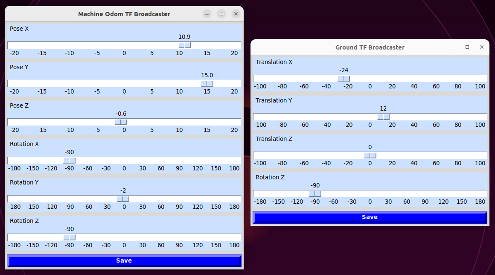
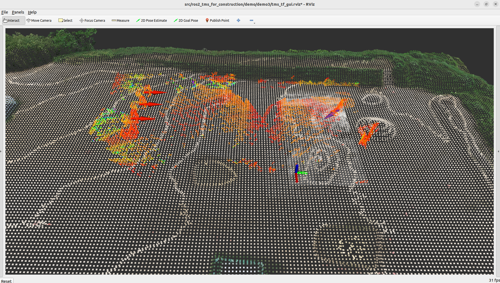

# tms_tf_gui

tms_tf_gui is a package for transforming construction data (ex. machine's location, terrain and hardness of ground) using GUI tool.

# Usecase

## Edit frame

Edit [params_file](./params_file.yaml).

```
ground_tf_broadcaster:
  ros__parameters:
     from_frame: ground_frame
     to_frame: world
odom_tf_broadcaster:
  ros__parameters:
     from_frame: odom_frame
     to_frame: world
```

## Launch GUI tools

Run the following command which launch GUI tool for transforming construction data.

```
ros2 launch tms_tf_gui tms_tf_gui_launch.py
```

The following GUI tools will be launched.



## Launch nodes

Launch nodes which have to check transformed topics.

```
ros2 launch tms_sp_machine tms_sp_machine_odom_demo_launch.py 
ros2 launch tms_sp_machine tms_sp_machine_points_launch.py input/machine_points:=/merge_points
ros2 launch tms_sd_ground tms_sd_ground_launch.py input/occupancy_grid:=/demo2/map_2d
```

## ros2 bag play

Please play following rosbags Static terrain data is the alignment reference.

- A topic of static terrain

```
ros2 bag play -l ./src/ros2_tms_for_construction/demo/demo3/rosbag2_static_terrain
```

- Topics that require coordinate transformation

```
ros2 bag play -l ./src/ros2_tms_for_construction/demo/demo3/rosbag2_tms_tf_gui
```

## Coordinate transformation

Please launch the Rviz to transform.

```
rviz2 -d ./src/ros2_tms_for_construction/demo/demo3/tms_tf_gui.rviz
```

While checking the topic after coordinate transformation with Rviz, perform coordinate transformation with the GUI tools.


